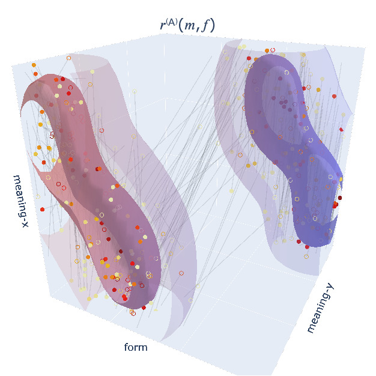
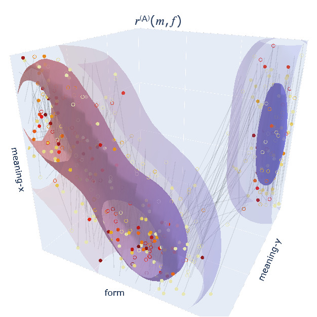
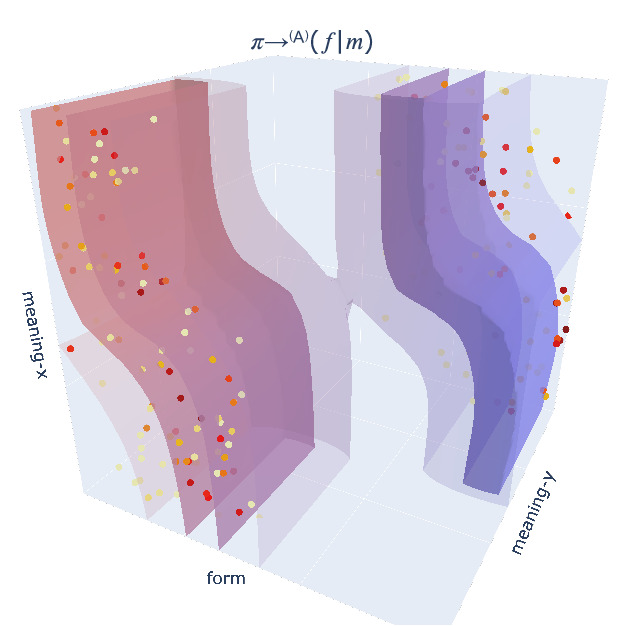
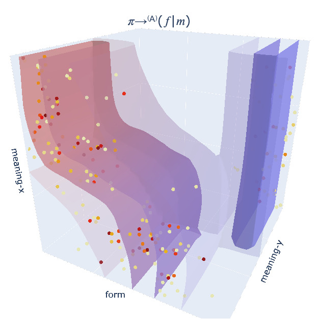
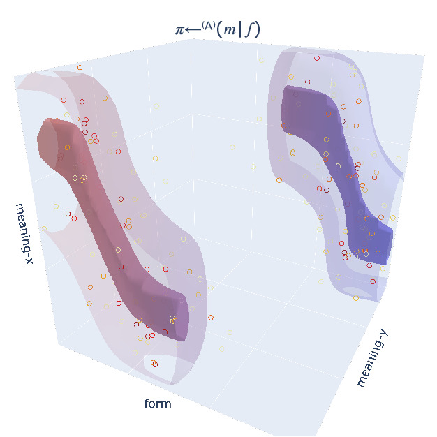
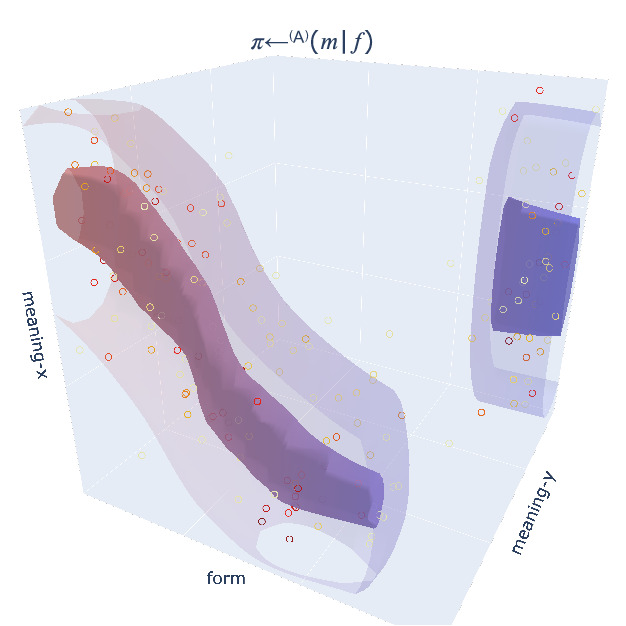
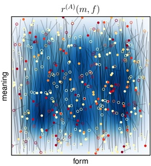

## Supplementary Material

### *TwoLines* World Model (Figure 13)

Please click on the link below the respective sub-figure to view the PDF or interactive 3D version:

| (l1, l2) = (0.5, 0.5) | (l1, l2) = (0.3, 0.7) |
| ---- | ---- |
|  |  |
| [PDF version](https://robert-lieck.github.io/emergence-of-symbols/figures/50_50_reward.pdf) / [interactive 3D version](https://robert-lieck.github.io/emergence-of-symbols/figures/50_50_reward.html) | [PDF version](https://robert-lieck.github.io/emergence-of-symbols/figures/30_70_reward.pdf) / [interactive 3D version](https://robert-lieck.github.io/emergence-of-symbols/figures/30_70_reward.html) |
|  |  |
| [PDF version](https://robert-lieck.github.io/emergence-of-symbols/figures/50_50_sender_policy.pdf) / [interactive 3D version](https://robert-lieck.github.io/emergence-of-symbols/figures/50_50_sender_policy.html) | [PDF version](https://robert-lieck.github.io/emergence-of-symbols/figures/30_70_sender_policy.pdf) / [interactive 3D version](https://robert-lieck.github.io/emergence-of-symbols/figures/30_70_sender_policy.html) |
|  |  |
| [PDF version](https://robert-lieck.github.io/emergence-of-symbols/figures/50_50_receiver_policy.pdf) / [interactive 3D version](https://robert-lieck.github.io/emergence-of-symbols/figures/50_50_receiver_policy.html) | [PDF version](https://robert-lieck.github.io/emergence-of-symbols/figures/30_70_receiver_policy.pdf) / [interactive 3D version](https://robert-lieck.github.io/emergence-of-symbols/figures/30_70_receiver_policy.html) |

### Learning Progress (Figure 8)

<video controls loop width="100%" src="figures/learning_progress/overview.mp4"></video>

| Iteration (Agent) | Expected Reward | Sender Policy | Receiver Policy | Permissibility Regions | Symbols |
| ---- | ---- | ---- | ---- | ---- | ---- |
| 0 (A) | .jpg) | .jpg) | .jpg) | .jpg) | .jpg) |
|       | [PDF](figures/learning_progress/pdf/iteration-0000000_(002).pdf) | [PDF](figures/learning_progress/pdf/iteration-0000000_(004).pdf) | [PDF](figures/learning_progress/pdf/iteration-0000000_(005).pdf) | [PDF](figures/learning_progress/pdf/iteration-0000000_(011).pdf) | [PDF](figures/learning_progress/pdf/iteration-0000000_(012).pdf) |
| 0 (B) | .jpg) | .jpg) | .jpg) | .jpg) | .jpg) |
|       | [PDF](figures/learning_progress/pdf/iteration-0000000_(007).pdf) | [PDF](figures/learning_progress/pdf/iteration-0000000_(009).pdf) | [PDF](figures/learning_progress/pdf/iteration-0000000_(010).pdf) | [PDF](figures/learning_progress/pdf/iteration-0000000_(013).pdf) | [PDF](figures/learning_progress/pdf/iteration-0000000_(014).pdf) |
| 1 (A) | .jpg) | .jpg) | .jpg) | .jpg) | .jpg) |
|       | [PDF](figures/learning_progress/pdf/iteration-0000001_(002).pdf) | [PDF](figures/learning_progress/pdf/iteration-0000001_(004).pdf) | [PDF](figures/learning_progress/pdf/iteration-0000001_(005).pdf) | [PDF](figures/learning_progress/pdf/iteration-0000001_(011).pdf) | [PDF](figures/learning_progress/pdf/iteration-0000001_(012).pdf) |
| 1 (B) | .jpg) | .jpg) | .jpg) | .jpg) | .jpg) |
|       | [PDF](figures/learning_progress/pdf/iteration-0000001_(007).pdf) | [PDF](figures/learning_progress/pdf/iteration-0000001_(009).pdf) | [PDF](figures/learning_progress/pdf/iteration-0000001_(010).pdf) | [PDF](figures/learning_progress/pdf/iteration-0000001_(013).pdf) | [PDF](figures/learning_progress/pdf/iteration-0000001_(014).pdf) |
| 2 (A) | .jpg) | .jpg) | .jpg) | .jpg) | .jpg) |
|       | [PDF](figures/learning_progress/pdf/iteration-0000002_(002).pdf) | [PDF](figures/learning_progress/pdf/iteration-0000002_(004).pdf) | [PDF](figures/learning_progress/pdf/iteration-0000002_(005).pdf) | [PDF](figures/learning_progress/pdf/iteration-0000002_(011).pdf) | [PDF](figures/learning_progress/pdf/iteration-0000002_(012).pdf) |
| 2 (B) | .jpg) | .jpg) | .jpg) | .jpg) | .jpg) |
|       | [PDF](figures/learning_progress/pdf/iteration-0000002_(007).pdf) | [PDF](figures/learning_progress/pdf/iteration-0000002_(009).pdf) | [PDF](figures/learning_progress/pdf/iteration-0000002_(010).pdf) | [PDF](figures/learning_progress/pdf/iteration-0000002_(013).pdf) | [PDF](figures/learning_progress/pdf/iteration-0000002_(014).pdf) |
| 3 (A) | .jpg) | .jpg) | .jpg) | .jpg) | .jpg) |
|       | [PDF](figures/learning_progress/pdf/iteration-0000003_(002).pdf) | [PDF](figures/learning_progress/pdf/iteration-0000003_(004).pdf) | [PDF](figures/learning_progress/pdf/iteration-0000003_(005).pdf) | [PDF](figures/learning_progress/pdf/iteration-0000003_(011).pdf) | [PDF](figures/learning_progress/pdf/iteration-0000003_(012).pdf) |
| 3 (B) | .jpg) | .jpg) | .jpg) | .jpg) | .jpg) |
|       | [PDF](figures/learning_progress/pdf/iteration-0000003_(007).pdf) | [PDF](figures/learning_progress/pdf/iteration-0000003_(009).pdf) | [PDF](figures/learning_progress/pdf/iteration-0000003_(010).pdf) | [PDF](figures/learning_progress/pdf/iteration-0000003_(013).pdf) | [PDF](figures/learning_progress/pdf/iteration-0000003_(014).pdf) |
| 4 (A) | .jpg) | .jpg) | .jpg) | .jpg) | .jpg) |
|       | [PDF](figures/learning_progress/pdf/iteration-0000004_(002).pdf) | [PDF](figures/learning_progress/pdf/iteration-0000004_(004).pdf) | [PDF](figures/learning_progress/pdf/iteration-0000004_(005).pdf) | [PDF](figures/learning_progress/pdf/iteration-0000004_(011).pdf) | [PDF](figures/learning_progress/pdf/iteration-0000004_(012).pdf) |
| 4 (B) | .jpg) | .jpg) | .jpg) | .jpg) | .jpg) |
|       | [PDF](figures/learning_progress/pdf/iteration-0000004_(007).pdf) | [PDF](figures/learning_progress/pdf/iteration-0000004_(009).pdf) | [PDF](figures/learning_progress/pdf/iteration-0000004_(010).pdf) | [PDF](figures/learning_progress/pdf/iteration-0000004_(013).pdf) | [PDF](figures/learning_progress/pdf/iteration-0000004_(014).pdf) |
| 5 (A) | .jpg) | .jpg) | .jpg) | .jpg) | .jpg) |
|       | [PDF](figures/learning_progress/pdf/iteration-0000005_(002).pdf) | [PDF](figures/learning_progress/pdf/iteration-0000005_(004).pdf) | [PDF](figures/learning_progress/pdf/iteration-0000005_(005).pdf) | [PDF](figures/learning_progress/pdf/iteration-0000005_(011).pdf) | [PDF](figures/learning_progress/pdf/iteration-0000005_(012).pdf) |
| 5 (B) | .jpg) | .jpg) | .jpg) | .jpg) | .jpg) |
|       | [PDF](figures/learning_progress/pdf/iteration-0000005_(007).pdf) | [PDF](figures/learning_progress/pdf/iteration-0000005_(009).pdf) | [PDF](figures/learning_progress/pdf/iteration-0000005_(010).pdf) | [PDF](figures/learning_progress/pdf/iteration-0000005_(013).pdf) | [PDF](figures/learning_progress/pdf/iteration-0000005_(014).pdf) |
| 6 (A) | .jpg) | .jpg) | .jpg) | .jpg) | .jpg) |
|       | [PDF](figures/learning_progress/pdf/iteration-0000006_(002).pdf) | [PDF](figures/learning_progress/pdf/iteration-0000006_(004).pdf) | [PDF](figures/learning_progress/pdf/iteration-0000006_(005).pdf) | [PDF](figures/learning_progress/pdf/iteration-0000006_(011).pdf) | [PDF](figures/learning_progress/pdf/iteration-0000006_(012).pdf) |
| 6 (B) | .jpg) | .jpg) | .jpg) | .jpg) | .jpg) |
|       | [PDF](figures/learning_progress/pdf/iteration-0000006_(007).pdf) | [PDF](figures/learning_progress/pdf/iteration-0000006_(009).pdf) | [PDF](figures/learning_progress/pdf/iteration-0000006_(010).pdf) | [PDF](figures/learning_progress/pdf/iteration-0000006_(013).pdf) | [PDF](figures/learning_progress/pdf/iteration-0000006_(014).pdf) |
| 7 (A) | .jpg) | .jpg) | .jpg) | .jpg) | .jpg) |
|       | [PDF](figures/learning_progress/pdf/iteration-0000007_(002).pdf) | [PDF](figures/learning_progress/pdf/iteration-0000007_(004).pdf) | [PDF](figures/learning_progress/pdf/iteration-0000007_(005).pdf) | [PDF](figures/learning_progress/pdf/iteration-0000007_(011).pdf) | [PDF](figures/learning_progress/pdf/iteration-0000007_(012).pdf) |
| 7 (B) | .jpg) | .jpg) | .jpg) | .jpg) | .jpg) |
|       | [PDF](figures/learning_progress/pdf/iteration-0000007_(007).pdf) | [PDF](figures/learning_progress/pdf/iteration-0000007_(009).pdf) | [PDF](figures/learning_progress/pdf/iteration-0000007_(010).pdf) | [PDF](figures/learning_progress/pdf/iteration-0000007_(013).pdf) | [PDF](figures/learning_progress/pdf/iteration-0000007_(014).pdf) |
| 8 (A) | .jpg) | .jpg) | .jpg) | .jpg) | .jpg) |
|       | [PDF](figures/learning_progress/pdf/iteration-0000008_(002).pdf) | [PDF](figures/learning_progress/pdf/iteration-0000008_(004).pdf) | [PDF](figures/learning_progress/pdf/iteration-0000008_(005).pdf) | [PDF](figures/learning_progress/pdf/iteration-0000008_(011).pdf) | [PDF](figures/learning_progress/pdf/iteration-0000008_(012).pdf) |
| 8 (B) | .jpg) | .jpg) | .jpg) | .jpg) | .jpg) |
|       | [PDF](figures/learning_progress/pdf/iteration-0000008_(007).pdf) | [PDF](figures/learning_progress/pdf/iteration-0000008_(009).pdf) | [PDF](figures/learning_progress/pdf/iteration-0000008_(010).pdf) | [PDF](figures/learning_progress/pdf/iteration-0000008_(013).pdf) | [PDF](figures/learning_progress/pdf/iteration-0000008_(014).pdf) |
| 9 (A) | .jpg) | .jpg) | .jpg) | .jpg) | .jpg) |
|       | [PDF](figures/learning_progress/pdf/iteration-0000009_(002).pdf) | [PDF](figures/learning_progress/pdf/iteration-0000009_(004).pdf) | [PDF](figures/learning_progress/pdf/iteration-0000009_(005).pdf) | [PDF](figures/learning_progress/pdf/iteration-0000009_(011).pdf) | [PDF](figures/learning_progress/pdf/iteration-0000009_(012).pdf) |
| 9 (B) | .jpg) | .jpg) | .jpg) | .jpg) | .jpg) |
|       | [PDF](figures/learning_progress/pdf/iteration-0000009_(007).pdf) | [PDF](figures/learning_progress/pdf/iteration-0000009_(009).pdf) | [PDF](figures/learning_progress/pdf/iteration-0000009_(010).pdf) | [PDF](figures/learning_progress/pdf/iteration-0000009_(013).pdf) | [PDF](figures/learning_progress/pdf/iteration-0000009_(014).pdf) |
| 10 (A) | .jpg) | .jpg) | .jpg) | .jpg) | .jpg) |
|       | [PDF](figures/learning_progress/pdf/iteration-0000010_(002).pdf) | [PDF](figures/learning_progress/pdf/iteration-0000010_(004).pdf) | [PDF](figures/learning_progress/pdf/iteration-0000010_(005).pdf) | [PDF](figures/learning_progress/pdf/iteration-0000010_(011).pdf) | [PDF](figures/learning_progress/pdf/iteration-0000010_(012).pdf) |
| 10 (B) | .jpg) | .jpg) | .jpg) | .jpg) | .jpg) |
|       | [PDF](figures/learning_progress/pdf/iteration-0000010_(007).pdf) | [PDF](figures/learning_progress/pdf/iteration-0000010_(009).pdf) | [PDF](figures/learning_progress/pdf/iteration-0000010_(010).pdf) | [PDF](figures/learning_progress/pdf/iteration-0000010_(013).pdf) | [PDF](figures/learning_progress/pdf/iteration-0000010_(014).pdf) |
| 11 (A) | .jpg) | .jpg) | .jpg) | .jpg) | .jpg) |
|       | [PDF](figures/learning_progress/pdf/iteration-0000011_(002).pdf) | [PDF](figures/learning_progress/pdf/iteration-0000011_(004).pdf) | [PDF](figures/learning_progress/pdf/iteration-0000011_(005).pdf) | [PDF](figures/learning_progress/pdf/iteration-0000011_(011).pdf) | [PDF](figures/learning_progress/pdf/iteration-0000011_(012).pdf) |
| 11 (B) | .jpg) | .jpg) | .jpg) | .jpg) | .jpg) |
|       | [PDF](figures/learning_progress/pdf/iteration-0000011_(007).pdf) | [PDF](figures/learning_progress/pdf/iteration-0000011_(009).pdf) | [PDF](figures/learning_progress/pdf/iteration-0000011_(010).pdf) | [PDF](figures/learning_progress/pdf/iteration-0000011_(013).pdf) | [PDF](figures/learning_progress/pdf/iteration-0000011_(014).pdf) |
| 12 (A) | .jpg) | .jpg) | .jpg) | .jpg) | .jpg) |
|       | [PDF](figures/learning_progress/pdf/iteration-0000012_(002).pdf) | [PDF](figures/learning_progress/pdf/iteration-0000012_(004).pdf) | [PDF](figures/learning_progress/pdf/iteration-0000012_(005).pdf) | [PDF](figures/learning_progress/pdf/iteration-0000012_(011).pdf) | [PDF](figures/learning_progress/pdf/iteration-0000012_(012).pdf) |
| 12 (B) | .jpg) | .jpg) | .jpg) | .jpg) | .jpg) |
|       | [PDF](figures/learning_progress/pdf/iteration-0000012_(007).pdf) | [PDF](figures/learning_progress/pdf/iteration-0000012_(009).pdf) | [PDF](figures/learning_progress/pdf/iteration-0000012_(010).pdf) | [PDF](figures/learning_progress/pdf/iteration-0000012_(013).pdf) | [PDF](figures/learning_progress/pdf/iteration-0000012_(014).pdf) |
| 13 (A) | .jpg) | .jpg) | .jpg) | .jpg) | .jpg) |
|       | [PDF](figures/learning_progress/pdf/iteration-0000013_(002).pdf) | [PDF](figures/learning_progress/pdf/iteration-0000013_(004).pdf) | [PDF](figures/learning_progress/pdf/iteration-0000013_(005).pdf) | [PDF](figures/learning_progress/pdf/iteration-0000013_(011).pdf) | [PDF](figures/learning_progress/pdf/iteration-0000013_(012).pdf) |
| 13 (B) | .jpg) | .jpg) | .jpg) | .jpg) | .jpg) |
|       | [PDF](figures/learning_progress/pdf/iteration-0000013_(007).pdf) | [PDF](figures/learning_progress/pdf/iteration-0000013_(009).pdf) | [PDF](figures/learning_progress/pdf/iteration-0000013_(010).pdf) | [PDF](figures/learning_progress/pdf/iteration-0000013_(013).pdf) | [PDF](figures/learning_progress/pdf/iteration-0000013_(014).pdf) |
| 14 (A) | .jpg) | .jpg) | .jpg) | .jpg) | .jpg) |
|       | [PDF](figures/learning_progress/pdf/iteration-0000014_(002).pdf) | [PDF](figures/learning_progress/pdf/iteration-0000014_(004).pdf) | [PDF](figures/learning_progress/pdf/iteration-0000014_(005).pdf) | [PDF](figures/learning_progress/pdf/iteration-0000014_(011).pdf) | [PDF](figures/learning_progress/pdf/iteration-0000014_(012).pdf) |
| 14 (B) | .jpg) | .jpg) | .jpg) | .jpg) | .jpg) |
|       | [PDF](figures/learning_progress/pdf/iteration-0000014_(007).pdf) | [PDF](figures/learning_progress/pdf/iteration-0000014_(009).pdf) | [PDF](figures/learning_progress/pdf/iteration-0000014_(010).pdf) | [PDF](figures/learning_progress/pdf/iteration-0000014_(013).pdf) | [PDF](figures/learning_progress/pdf/iteration-0000014_(014).pdf) |
| 15 (A) | .jpg) | .jpg) | .jpg) | .jpg) | .jpg) |
|       | [PDF](figures/learning_progress/pdf/iteration-0000015_(002).pdf) | [PDF](figures/learning_progress/pdf/iteration-0000015_(004).pdf) | [PDF](figures/learning_progress/pdf/iteration-0000015_(005).pdf) | [PDF](figures/learning_progress/pdf/iteration-0000015_(011).pdf) | [PDF](figures/learning_progress/pdf/iteration-0000015_(012).pdf) |
| 15 (B) | .jpg) | .jpg) | .jpg) | .jpg) | .jpg) |
|       | [PDF](figures/learning_progress/pdf/iteration-0000015_(007).pdf) | [PDF](figures/learning_progress/pdf/iteration-0000015_(009).pdf) | [PDF](figures/learning_progress/pdf/iteration-0000015_(010).pdf) | [PDF](figures/learning_progress/pdf/iteration-0000015_(013).pdf) | [PDF](figures/learning_progress/pdf/iteration-0000015_(014).pdf) |
| 16 (A) | .jpg) | .jpg) | .jpg) | .jpg) | .jpg) |
|       | [PDF](figures/learning_progress/pdf/iteration-0000016_(002).pdf) | [PDF](figures/learning_progress/pdf/iteration-0000016_(004).pdf) | [PDF](figures/learning_progress/pdf/iteration-0000016_(005).pdf) | [PDF](figures/learning_progress/pdf/iteration-0000016_(011).pdf) | [PDF](figures/learning_progress/pdf/iteration-0000016_(012).pdf) |
| 16 (B) | .jpg) | .jpg) | .jpg) | .jpg) | .jpg) |
|       | [PDF](figures/learning_progress/pdf/iteration-0000016_(007).pdf) | [PDF](figures/learning_progress/pdf/iteration-0000016_(009).pdf) | [PDF](figures/learning_progress/pdf/iteration-0000016_(010).pdf) | [PDF](figures/learning_progress/pdf/iteration-0000016_(013).pdf) | [PDF](figures/learning_progress/pdf/iteration-0000016_(014).pdf) |
| 17 (A) | .jpg) | .jpg) | .jpg) | .jpg) | .jpg) |
|       | [PDF](figures/learning_progress/pdf/iteration-0000017_(002).pdf) | [PDF](figures/learning_progress/pdf/iteration-0000017_(004).pdf) | [PDF](figures/learning_progress/pdf/iteration-0000017_(005).pdf) | [PDF](figures/learning_progress/pdf/iteration-0000017_(011).pdf) | [PDF](figures/learning_progress/pdf/iteration-0000017_(012).pdf) |
| 17 (B) | .jpg) | .jpg) | .jpg) | .jpg) | .jpg) |
|       | [PDF](figures/learning_progress/pdf/iteration-0000017_(007).pdf) | [PDF](figures/learning_progress/pdf/iteration-0000017_(009).pdf) | [PDF](figures/learning_progress/pdf/iteration-0000017_(010).pdf) | [PDF](figures/learning_progress/pdf/iteration-0000017_(013).pdf) | [PDF](figures/learning_progress/pdf/iteration-0000017_(014).pdf) |
| 18 (A) | .jpg) | .jpg) | .jpg) | .jpg) | .jpg) |
|       | [PDF](figures/learning_progress/pdf/iteration-0000018_(002).pdf) | [PDF](figures/learning_progress/pdf/iteration-0000018_(004).pdf) | [PDF](figures/learning_progress/pdf/iteration-0000018_(005).pdf) | [PDF](figures/learning_progress/pdf/iteration-0000018_(011).pdf) | [PDF](figures/learning_progress/pdf/iteration-0000018_(012).pdf) |
| 18 (B) | .jpg) | .jpg) | .jpg) | .jpg) | .jpg) |
|       | [PDF](figures/learning_progress/pdf/iteration-0000018_(007).pdf) | [PDF](figures/learning_progress/pdf/iteration-0000018_(009).pdf) | [PDF](figures/learning_progress/pdf/iteration-0000018_(010).pdf) | [PDF](figures/learning_progress/pdf/iteration-0000018_(013).pdf) | [PDF](figures/learning_progress/pdf/iteration-0000018_(014).pdf) |
| 19 (A) | .jpg) | .jpg) | .jpg) | .jpg) | .jpg) |
|       | [PDF](figures/learning_progress/pdf/iteration-0000019_(002).pdf) | [PDF](figures/learning_progress/pdf/iteration-0000019_(004).pdf) | [PDF](figures/learning_progress/pdf/iteration-0000019_(005).pdf) | [PDF](figures/learning_progress/pdf/iteration-0000019_(011).pdf) | [PDF](figures/learning_progress/pdf/iteration-0000019_(012).pdf) |
| 19 (B) | .jpg) | .jpg) | .jpg) | .jpg) | .jpg) |
|       | [PDF](figures/learning_progress/pdf/iteration-0000019_(007).pdf) | [PDF](figures/learning_progress/pdf/iteration-0000019_(009).pdf) | [PDF](figures/learning_progress/pdf/iteration-0000019_(010).pdf) | [PDF](figures/learning_progress/pdf/iteration-0000019_(013).pdf) | [PDF](figures/learning_progress/pdf/iteration-0000019_(014).pdf) |
| 20 (A) | .jpg) | .jpg) | .jpg) | .jpg) | .jpg) |
|       | [PDF](figures/learning_progress/pdf/iteration-0000020_(002).pdf) | [PDF](figures/learning_progress/pdf/iteration-0000020_(004).pdf) | [PDF](figures/learning_progress/pdf/iteration-0000020_(005).pdf) | [PDF](figures/learning_progress/pdf/iteration-0000020_(011).pdf) | [PDF](figures/learning_progress/pdf/iteration-0000020_(012).pdf) |
| 20 (B) | .jpg) | .jpg) | .jpg) | .jpg) | .jpg) |
|       | [PDF](figures/learning_progress/pdf/iteration-0000020_(007).pdf) | [PDF](figures/learning_progress/pdf/iteration-0000020_(009).pdf) | [PDF](figures/learning_progress/pdf/iteration-0000020_(010).pdf) | [PDF](figures/learning_progress/pdf/iteration-0000020_(013).pdf) | [PDF](figures/learning_progress/pdf/iteration-0000020_(014).pdf) |
| 21 (A) | .jpg) | .jpg) | .jpg) | .jpg) | .jpg) |
|       | [PDF](figures/learning_progress/pdf/iteration-0000021_(002).pdf) | [PDF](figures/learning_progress/pdf/iteration-0000021_(004).pdf) | [PDF](figures/learning_progress/pdf/iteration-0000021_(005).pdf) | [PDF](figures/learning_progress/pdf/iteration-0000021_(011).pdf) | [PDF](figures/learning_progress/pdf/iteration-0000021_(012).pdf) |
| 21 (B) | .jpg) | .jpg) | .jpg) | .jpg) | .jpg) |
|       | [PDF](figures/learning_progress/pdf/iteration-0000021_(007).pdf) | [PDF](figures/learning_progress/pdf/iteration-0000021_(009).pdf) | [PDF](figures/learning_progress/pdf/iteration-0000021_(010).pdf) | [PDF](figures/learning_progress/pdf/iteration-0000021_(013).pdf) | [PDF](figures/learning_progress/pdf/iteration-0000021_(014).pdf) |
| 22 (A) | .jpg) | .jpg) | .jpg) | .jpg) | .jpg) |
|       | [PDF](figures/learning_progress/pdf/iteration-0000022_(002).pdf) | [PDF](figures/learning_progress/pdf/iteration-0000022_(004).pdf) | [PDF](figures/learning_progress/pdf/iteration-0000022_(005).pdf) | [PDF](figures/learning_progress/pdf/iteration-0000022_(011).pdf) | [PDF](figures/learning_progress/pdf/iteration-0000022_(012).pdf) |
| 22 (B) | .jpg) | .jpg) | .jpg) | .jpg) | .jpg) |
|       | [PDF](figures/learning_progress/pdf/iteration-0000022_(007).pdf) | [PDF](figures/learning_progress/pdf/iteration-0000022_(009).pdf) | [PDF](figures/learning_progress/pdf/iteration-0000022_(010).pdf) | [PDF](figures/learning_progress/pdf/iteration-0000022_(013).pdf) | [PDF](figures/learning_progress/pdf/iteration-0000022_(014).pdf) |
| 23 (A) | .jpg) | .jpg) | .jpg) | .jpg) | .jpg) |
|       | [PDF](figures/learning_progress/pdf/iteration-0000023_(002).pdf) | [PDF](figures/learning_progress/pdf/iteration-0000023_(004).pdf) | [PDF](figures/learning_progress/pdf/iteration-0000023_(005).pdf) | [PDF](figures/learning_progress/pdf/iteration-0000023_(011).pdf) | [PDF](figures/learning_progress/pdf/iteration-0000023_(012).pdf) |
| 23 (B) | .jpg) | .jpg) | .jpg) | .jpg) | .jpg) |
|       | [PDF](figures/learning_progress/pdf/iteration-0000023_(007).pdf) | [PDF](figures/learning_progress/pdf/iteration-0000023_(009).pdf) | [PDF](figures/learning_progress/pdf/iteration-0000023_(010).pdf) | [PDF](figures/learning_progress/pdf/iteration-0000023_(013).pdf) | [PDF](figures/learning_progress/pdf/iteration-0000023_(014).pdf) |
| 24 (A) | .jpg) | .jpg) | .jpg) | .jpg) | .jpg) |
|       | [PDF](figures/learning_progress/pdf/iteration-0000024_(002).pdf) | [PDF](figures/learning_progress/pdf/iteration-0000024_(004).pdf) | [PDF](figures/learning_progress/pdf/iteration-0000024_(005).pdf) | [PDF](figures/learning_progress/pdf/iteration-0000024_(011).pdf) | [PDF](figures/learning_progress/pdf/iteration-0000024_(012).pdf) |
| 24 (B) | .jpg) | .jpg) | .jpg) | .jpg) | .jpg) |
|       | [PDF](figures/learning_progress/pdf/iteration-0000024_(007).pdf) | [PDF](figures/learning_progress/pdf/iteration-0000024_(009).pdf) | [PDF](figures/learning_progress/pdf/iteration-0000024_(010).pdf) | [PDF](figures/learning_progress/pdf/iteration-0000024_(013).pdf) | [PDF](figures/learning_progress/pdf/iteration-0000024_(014).pdf) |
| 25 (A) | .jpg) | .jpg) | .jpg) | .jpg) | .jpg) |
|       | [PDF](figures/learning_progress/pdf/iteration-0000025_(002).pdf) | [PDF](figures/learning_progress/pdf/iteration-0000025_(004).pdf) | [PDF](figures/learning_progress/pdf/iteration-0000025_(005).pdf) | [PDF](figures/learning_progress/pdf/iteration-0000025_(011).pdf) | [PDF](figures/learning_progress/pdf/iteration-0000025_(012).pdf) |
| 25 (B) | .jpg) | .jpg) | .jpg) | .jpg) | .jpg) |
|       | [PDF](figures/learning_progress/pdf/iteration-0000025_(007).pdf) | [PDF](figures/learning_progress/pdf/iteration-0000025_(009).pdf) | [PDF](figures/learning_progress/pdf/iteration-0000025_(010).pdf) | [PDF](figures/learning_progress/pdf/iteration-0000025_(013).pdf) | [PDF](figures/learning_progress/pdf/iteration-0000025_(014).pdf) |
| 26 (A) | .jpg) | .jpg) | .jpg) | .jpg) | .jpg) |
|       | [PDF](figures/learning_progress/pdf/iteration-0000026_(002).pdf) | [PDF](figures/learning_progress/pdf/iteration-0000026_(004).pdf) | [PDF](figures/learning_progress/pdf/iteration-0000026_(005).pdf) | [PDF](figures/learning_progress/pdf/iteration-0000026_(011).pdf) | [PDF](figures/learning_progress/pdf/iteration-0000026_(012).pdf) |
| 26 (B) | .jpg) | .jpg) | .jpg) | .jpg) | .jpg) |
|       | [PDF](figures/learning_progress/pdf/iteration-0000026_(007).pdf) | [PDF](figures/learning_progress/pdf/iteration-0000026_(009).pdf) | [PDF](figures/learning_progress/pdf/iteration-0000026_(010).pdf) | [PDF](figures/learning_progress/pdf/iteration-0000026_(013).pdf) | [PDF](figures/learning_progress/pdf/iteration-0000026_(014).pdf) |
| 27 (A) | .jpg) | .jpg) | .jpg) | .jpg) | .jpg) |
|       | [PDF](figures/learning_progress/pdf/iteration-0000027_(002).pdf) | [PDF](figures/learning_progress/pdf/iteration-0000027_(004).pdf) | [PDF](figures/learning_progress/pdf/iteration-0000027_(005).pdf) | [PDF](figures/learning_progress/pdf/iteration-0000027_(011).pdf) | [PDF](figures/learning_progress/pdf/iteration-0000027_(012).pdf) |
| 27 (B) | .jpg) | .jpg) | .jpg) | .jpg) | .jpg) |
|       | [PDF](figures/learning_progress/pdf/iteration-0000027_(007).pdf) | [PDF](figures/learning_progress/pdf/iteration-0000027_(009).pdf) | [PDF](figures/learning_progress/pdf/iteration-0000027_(010).pdf) | [PDF](figures/learning_progress/pdf/iteration-0000027_(013).pdf) | [PDF](figures/learning_progress/pdf/iteration-0000027_(014).pdf) |
| 28 (A) | .jpg) | .jpg) | .jpg) | .jpg) | .jpg) |
|       | [PDF](figures/learning_progress/pdf/iteration-0000028_(002).pdf) | [PDF](figures/learning_progress/pdf/iteration-0000028_(004).pdf) | [PDF](figures/learning_progress/pdf/iteration-0000028_(005).pdf) | [PDF](figures/learning_progress/pdf/iteration-0000028_(011).pdf) | [PDF](figures/learning_progress/pdf/iteration-0000028_(012).pdf) |
| 28 (B) | .jpg) | .jpg) | .jpg) | .jpg) | .jpg) |
|       | [PDF](figures/learning_progress/pdf/iteration-0000028_(007).pdf) | [PDF](figures/learning_progress/pdf/iteration-0000028_(009).pdf) | [PDF](figures/learning_progress/pdf/iteration-0000028_(010).pdf) | [PDF](figures/learning_progress/pdf/iteration-0000028_(013).pdf) | [PDF](figures/learning_progress/pdf/iteration-0000028_(014).pdf) |
| 29 (A) | .jpg) | .jpg) | .jpg) | .jpg) | .jpg) |
|       | [PDF](figures/learning_progress/pdf/iteration-0000029_(002).pdf) | [PDF](figures/learning_progress/pdf/iteration-0000029_(004).pdf) | [PDF](figures/learning_progress/pdf/iteration-0000029_(005).pdf) | [PDF](figures/learning_progress/pdf/iteration-0000029_(011).pdf) | [PDF](figures/learning_progress/pdf/iteration-0000029_(012).pdf) |
| 29 (B) | .jpg) | .jpg) | .jpg) | .jpg) | .jpg) |
|       | [PDF](figures/learning_progress/pdf/iteration-0000029_(007).pdf) | [PDF](figures/learning_progress/pdf/iteration-0000029_(009).pdf) | [PDF](figures/learning_progress/pdf/iteration-0000029_(010).pdf) | [PDF](figures/learning_progress/pdf/iteration-0000029_(013).pdf) | [PDF](figures/learning_progress/pdf/iteration-0000029_(014).pdf) |
| 30 (A) | .jpg) | .jpg) | .jpg) | .jpg) | .jpg) |
|       | [PDF](figures/learning_progress/pdf/iteration-0000030_(002).pdf) | [PDF](figures/learning_progress/pdf/iteration-0000030_(004).pdf) | [PDF](figures/learning_progress/pdf/iteration-0000030_(005).pdf) | [PDF](figures/learning_progress/pdf/iteration-0000030_(011).pdf) | [PDF](figures/learning_progress/pdf/iteration-0000030_(012).pdf) |
| 30 (B) | .jpg) | .jpg) | .jpg) | .jpg) | .jpg) |
|       | [PDF](figures/learning_progress/pdf/iteration-0000030_(007).pdf) | [PDF](figures/learning_progress/pdf/iteration-0000030_(009).pdf) | [PDF](figures/learning_progress/pdf/iteration-0000030_(010).pdf) | [PDF](figures/learning_progress/pdf/iteration-0000030_(013).pdf) | [PDF](figures/learning_progress/pdf/iteration-0000030_(014).pdf) |
| 31 (A) | .jpg) | .jpg) | .jpg) | .jpg) | .jpg) |
|       | [PDF](figures/learning_progress/pdf/iteration-0000031_(002).pdf) | [PDF](figures/learning_progress/pdf/iteration-0000031_(004).pdf) | [PDF](figures/learning_progress/pdf/iteration-0000031_(005).pdf) | [PDF](figures/learning_progress/pdf/iteration-0000031_(011).pdf) | [PDF](figures/learning_progress/pdf/iteration-0000031_(012).pdf) |
| 31 (B) | .jpg) | .jpg) | .jpg) | .jpg) | .jpg) |
|       | [PDF](figures/learning_progress/pdf/iteration-0000031_(007).pdf) | [PDF](figures/learning_progress/pdf/iteration-0000031_(009).pdf) | [PDF](figures/learning_progress/pdf/iteration-0000031_(010).pdf) | [PDF](figures/learning_progress/pdf/iteration-0000031_(013).pdf) | [PDF](figures/learning_progress/pdf/iteration-0000031_(014).pdf) |
| 32 (A) | .jpg) | .jpg) | .jpg) | .jpg) | .jpg) |
|       | [PDF](figures/learning_progress/pdf/iteration-0000032_(002).pdf) | [PDF](figures/learning_progress/pdf/iteration-0000032_(004).pdf) | [PDF](figures/learning_progress/pdf/iteration-0000032_(005).pdf) | [PDF](figures/learning_progress/pdf/iteration-0000032_(011).pdf) | [PDF](figures/learning_progress/pdf/iteration-0000032_(012).pdf) |
| 32 (B) | .jpg) | .jpg) | .jpg) | .jpg) | .jpg) |
|       | [PDF](figures/learning_progress/pdf/iteration-0000032_(007).pdf) | [PDF](figures/learning_progress/pdf/iteration-0000032_(009).pdf) | [PDF](figures/learning_progress/pdf/iteration-0000032_(010).pdf) | [PDF](figures/learning_progress/pdf/iteration-0000032_(013).pdf) | [PDF](figures/learning_progress/pdf/iteration-0000032_(014).pdf) |
| 33 (A) | .jpg) | .jpg) | .jpg) | .jpg) | .jpg) |
|       | [PDF](figures/learning_progress/pdf/iteration-0000033_(002).pdf) | [PDF](figures/learning_progress/pdf/iteration-0000033_(004).pdf) | [PDF](figures/learning_progress/pdf/iteration-0000033_(005).pdf) | [PDF](figures/learning_progress/pdf/iteration-0000033_(011).pdf) | [PDF](figures/learning_progress/pdf/iteration-0000033_(012).pdf) |
| 33 (B) | .jpg) | .jpg) | .jpg) | .jpg) | .jpg) |
|       | [PDF](figures/learning_progress/pdf/iteration-0000033_(007).pdf) | [PDF](figures/learning_progress/pdf/iteration-0000033_(009).pdf) | [PDF](figures/learning_progress/pdf/iteration-0000033_(010).pdf) | [PDF](figures/learning_progress/pdf/iteration-0000033_(013).pdf) | [PDF](figures/learning_progress/pdf/iteration-0000033_(014).pdf) |
| 34 (A) | .jpg) | .jpg) | .jpg) | .jpg) | .jpg) |
|       | [PDF](figures/learning_progress/pdf/iteration-0000034_(002).pdf) | [PDF](figures/learning_progress/pdf/iteration-0000034_(004).pdf) | [PDF](figures/learning_progress/pdf/iteration-0000034_(005).pdf) | [PDF](figures/learning_progress/pdf/iteration-0000034_(011).pdf) | [PDF](figures/learning_progress/pdf/iteration-0000034_(012).pdf) |
| 34 (B) | .jpg) | .jpg) | .jpg) | .jpg) | .jpg) |
|       | [PDF](figures/learning_progress/pdf/iteration-0000034_(007).pdf) | [PDF](figures/learning_progress/pdf/iteration-0000034_(009).pdf) | [PDF](figures/learning_progress/pdf/iteration-0000034_(010).pdf) | [PDF](figures/learning_progress/pdf/iteration-0000034_(013).pdf) | [PDF](figures/learning_progress/pdf/iteration-0000034_(014).pdf) |
| 35 (A) | .jpg) | .jpg) | .jpg) | .jpg) | .jpg) |
|       | [PDF](figures/learning_progress/pdf/iteration-0000035_(002).pdf) | [PDF](figures/learning_progress/pdf/iteration-0000035_(004).pdf) | [PDF](figures/learning_progress/pdf/iteration-0000035_(005).pdf) | [PDF](figures/learning_progress/pdf/iteration-0000035_(011).pdf) | [PDF](figures/learning_progress/pdf/iteration-0000035_(012).pdf) |
| 35 (B) | .jpg) | .jpg) | .jpg) | .jpg) | .jpg) |
|       | [PDF](figures/learning_progress/pdf/iteration-0000035_(007).pdf) | [PDF](figures/learning_progress/pdf/iteration-0000035_(009).pdf) | [PDF](figures/learning_progress/pdf/iteration-0000035_(010).pdf) | [PDF](figures/learning_progress/pdf/iteration-0000035_(013).pdf) | [PDF](figures/learning_progress/pdf/iteration-0000035_(014).pdf) |
| 36 (A) | .jpg) | .jpg) | .jpg) | .jpg) | .jpg) |
|       | [PDF](figures/learning_progress/pdf/iteration-0000036_(002).pdf) | [PDF](figures/learning_progress/pdf/iteration-0000036_(004).pdf) | [PDF](figures/learning_progress/pdf/iteration-0000036_(005).pdf) | [PDF](figures/learning_progress/pdf/iteration-0000036_(011).pdf) | [PDF](figures/learning_progress/pdf/iteration-0000036_(012).pdf) |
| 36 (B) | .jpg) | .jpg) | .jpg) | .jpg) | .jpg) |
|       | [PDF](figures/learning_progress/pdf/iteration-0000036_(007).pdf) | [PDF](figures/learning_progress/pdf/iteration-0000036_(009).pdf) | [PDF](figures/learning_progress/pdf/iteration-0000036_(010).pdf) | [PDF](figures/learning_progress/pdf/iteration-0000036_(013).pdf) | [PDF](figures/learning_progress/pdf/iteration-0000036_(014).pdf) |
| 37 (A) | .jpg) | .jpg) | .jpg) | .jpg) | .jpg) |
|       | [PDF](figures/learning_progress/pdf/iteration-0000037_(002).pdf) | [PDF](figures/learning_progress/pdf/iteration-0000037_(004).pdf) | [PDF](figures/learning_progress/pdf/iteration-0000037_(005).pdf) | [PDF](figures/learning_progress/pdf/iteration-0000037_(011).pdf) | [PDF](figures/learning_progress/pdf/iteration-0000037_(012).pdf) |
| 37 (B) | .jpg) | .jpg) | .jpg) | .jpg) | .jpg) |
|       | [PDF](figures/learning_progress/pdf/iteration-0000037_(007).pdf) | [PDF](figures/learning_progress/pdf/iteration-0000037_(009).pdf) | [PDF](figures/learning_progress/pdf/iteration-0000037_(010).pdf) | [PDF](figures/learning_progress/pdf/iteration-0000037_(013).pdf) | [PDF](figures/learning_progress/pdf/iteration-0000037_(014).pdf) |
| 38 (A) | .jpg) | .jpg) | .jpg) | .jpg) | .jpg) |
|       | [PDF](figures/learning_progress/pdf/iteration-0000038_(002).pdf) | [PDF](figures/learning_progress/pdf/iteration-0000038_(004).pdf) | [PDF](figures/learning_progress/pdf/iteration-0000038_(005).pdf) | [PDF](figures/learning_progress/pdf/iteration-0000038_(011).pdf) | [PDF](figures/learning_progress/pdf/iteration-0000038_(012).pdf) |
| 38 (B) | .jpg) | .jpg) | .jpg) | .jpg) | .jpg) |
|       | [PDF](figures/learning_progress/pdf/iteration-0000038_(007).pdf) | [PDF](figures/learning_progress/pdf/iteration-0000038_(009).pdf) | [PDF](figures/learning_progress/pdf/iteration-0000038_(010).pdf) | [PDF](figures/learning_progress/pdf/iteration-0000038_(013).pdf) | [PDF](figures/learning_progress/pdf/iteration-0000038_(014).pdf) |
| 39 (A) | .jpg) | .jpg) | .jpg) | .jpg) | .jpg) |
|       | [PDF](figures/learning_progress/pdf/iteration-0000039_(002).pdf) | [PDF](figures/learning_progress/pdf/iteration-0000039_(004).pdf) | [PDF](figures/learning_progress/pdf/iteration-0000039_(005).pdf) | [PDF](figures/learning_progress/pdf/iteration-0000039_(011).pdf) | [PDF](figures/learning_progress/pdf/iteration-0000039_(012).pdf) |
| 39 (B) | .jpg) | .jpg) | .jpg) | .jpg) | .jpg) |
|       | [PDF](figures/learning_progress/pdf/iteration-0000039_(007).pdf) | [PDF](figures/learning_progress/pdf/iteration-0000039_(009).pdf) | [PDF](figures/learning_progress/pdf/iteration-0000039_(010).pdf) | [PDF](figures/learning_progress/pdf/iteration-0000039_(013).pdf) | [PDF](figures/learning_progress/pdf/iteration-0000039_(014).pdf) |
| 40 (A) | .jpg) | .jpg) | .jpg) | .jpg) | .jpg) |
|       | [PDF](figures/learning_progress/pdf/iteration-0000040_(002).pdf) | [PDF](figures/learning_progress/pdf/iteration-0000040_(004).pdf) | [PDF](figures/learning_progress/pdf/iteration-0000040_(005).pdf) | [PDF](figures/learning_progress/pdf/iteration-0000040_(011).pdf) | [PDF](figures/learning_progress/pdf/iteration-0000040_(012).pdf) |
| 40 (B) | .jpg) | .jpg) | .jpg) | .jpg) | .jpg) |
|       | [PDF](figures/learning_progress/pdf/iteration-0000040_(007).pdf) | [PDF](figures/learning_progress/pdf/iteration-0000040_(009).pdf) | [PDF](figures/learning_progress/pdf/iteration-0000040_(010).pdf) | [PDF](figures/learning_progress/pdf/iteration-0000040_(013).pdf) | [PDF](figures/learning_progress/pdf/iteration-0000040_(014).pdf) |
| 41 (A) | .jpg) | .jpg) | .jpg) | .jpg) | .jpg) |
|       | [PDF](figures/learning_progress/pdf/iteration-0000041_(002).pdf) | [PDF](figures/learning_progress/pdf/iteration-0000041_(004).pdf) | [PDF](figures/learning_progress/pdf/iteration-0000041_(005).pdf) | [PDF](figures/learning_progress/pdf/iteration-0000041_(011).pdf) | [PDF](figures/learning_progress/pdf/iteration-0000041_(012).pdf) |
| 41 (B) | .jpg) | .jpg) | .jpg) | .jpg) | .jpg) |
|       | [PDF](figures/learning_progress/pdf/iteration-0000041_(007).pdf) | [PDF](figures/learning_progress/pdf/iteration-0000041_(009).pdf) | [PDF](figures/learning_progress/pdf/iteration-0000041_(010).pdf) | [PDF](figures/learning_progress/pdf/iteration-0000041_(013).pdf) | [PDF](figures/learning_progress/pdf/iteration-0000041_(014).pdf) |
| 42 (A) | .jpg) | .jpg) | .jpg) | .jpg) | .jpg) |
|       | [PDF](figures/learning_progress/pdf/iteration-0000042_(002).pdf) | [PDF](figures/learning_progress/pdf/iteration-0000042_(004).pdf) | [PDF](figures/learning_progress/pdf/iteration-0000042_(005).pdf) | [PDF](figures/learning_progress/pdf/iteration-0000042_(011).pdf) | [PDF](figures/learning_progress/pdf/iteration-0000042_(012).pdf) |
| 42 (B) | .jpg) | .jpg) | .jpg) | .jpg) | .jpg) |
|       | [PDF](figures/learning_progress/pdf/iteration-0000042_(007).pdf) | [PDF](figures/learning_progress/pdf/iteration-0000042_(009).pdf) | [PDF](figures/learning_progress/pdf/iteration-0000042_(010).pdf) | [PDF](figures/learning_progress/pdf/iteration-0000042_(013).pdf) | [PDF](figures/learning_progress/pdf/iteration-0000042_(014).pdf) |
| 43 (A) | .jpg) | .jpg) | .jpg) | .jpg) | .jpg) |
|       | [PDF](figures/learning_progress/pdf/iteration-0000043_(002).pdf) | [PDF](figures/learning_progress/pdf/iteration-0000043_(004).pdf) | [PDF](figures/learning_progress/pdf/iteration-0000043_(005).pdf) | [PDF](figures/learning_progress/pdf/iteration-0000043_(011).pdf) | [PDF](figures/learning_progress/pdf/iteration-0000043_(012).pdf) |
| 43 (B) | .jpg) | .jpg) | .jpg) | .jpg) | .jpg) |
|       | [PDF](figures/learning_progress/pdf/iteration-0000043_(007).pdf) | [PDF](figures/learning_progress/pdf/iteration-0000043_(009).pdf) | [PDF](figures/learning_progress/pdf/iteration-0000043_(010).pdf) | [PDF](figures/learning_progress/pdf/iteration-0000043_(013).pdf) | [PDF](figures/learning_progress/pdf/iteration-0000043_(014).pdf) |
| 44 (A) | .jpg) | .jpg) | .jpg) | .jpg) | .jpg) |
|       | [PDF](figures/learning_progress/pdf/iteration-0000044_(002).pdf) | [PDF](figures/learning_progress/pdf/iteration-0000044_(004).pdf) | [PDF](figures/learning_progress/pdf/iteration-0000044_(005).pdf) | [PDF](figures/learning_progress/pdf/iteration-0000044_(011).pdf) | [PDF](figures/learning_progress/pdf/iteration-0000044_(012).pdf) |
| 44 (B) | .jpg) | .jpg) | .jpg) | .jpg) | .jpg) |
|       | [PDF](figures/learning_progress/pdf/iteration-0000044_(007).pdf) | [PDF](figures/learning_progress/pdf/iteration-0000044_(009).pdf) | [PDF](figures/learning_progress/pdf/iteration-0000044_(010).pdf) | [PDF](figures/learning_progress/pdf/iteration-0000044_(013).pdf) | [PDF](figures/learning_progress/pdf/iteration-0000044_(014).pdf) |
| 45 (A) | .jpg) | .jpg) | .jpg) | .jpg) | .jpg) |
|       | [PDF](figures/learning_progress/pdf/iteration-0000045_(002).pdf) | [PDF](figures/learning_progress/pdf/iteration-0000045_(004).pdf) | [PDF](figures/learning_progress/pdf/iteration-0000045_(005).pdf) | [PDF](figures/learning_progress/pdf/iteration-0000045_(011).pdf) | [PDF](figures/learning_progress/pdf/iteration-0000045_(012).pdf) |
| 45 (B) | .jpg) | .jpg) | .jpg) | .jpg) | .jpg) |
|       | [PDF](figures/learning_progress/pdf/iteration-0000045_(007).pdf) | [PDF](figures/learning_progress/pdf/iteration-0000045_(009).pdf) | [PDF](figures/learning_progress/pdf/iteration-0000045_(010).pdf) | [PDF](figures/learning_progress/pdf/iteration-0000045_(013).pdf) | [PDF](figures/learning_progress/pdf/iteration-0000045_(014).pdf) |
| 46 (A) | .jpg) | .jpg) | .jpg) | .jpg) | .jpg) |
|       | [PDF](figures/learning_progress/pdf/iteration-0000046_(002).pdf) | [PDF](figures/learning_progress/pdf/iteration-0000046_(004).pdf) | [PDF](figures/learning_progress/pdf/iteration-0000046_(005).pdf) | [PDF](figures/learning_progress/pdf/iteration-0000046_(011).pdf) | [PDF](figures/learning_progress/pdf/iteration-0000046_(012).pdf) |
| 46 (B) | .jpg) | .jpg) | .jpg) | .jpg) | .jpg) |
|       | [PDF](figures/learning_progress/pdf/iteration-0000046_(007).pdf) | [PDF](figures/learning_progress/pdf/iteration-0000046_(009).pdf) | [PDF](figures/learning_progress/pdf/iteration-0000046_(010).pdf) | [PDF](figures/learning_progress/pdf/iteration-0000046_(013).pdf) | [PDF](figures/learning_progress/pdf/iteration-0000046_(014).pdf) |
| 47 (A) | .jpg) | .jpg) | .jpg) | .jpg) | .jpg) |
|       | [PDF](figures/learning_progress/pdf/iteration-0000047_(002).pdf) | [PDF](figures/learning_progress/pdf/iteration-0000047_(004).pdf) | [PDF](figures/learning_progress/pdf/iteration-0000047_(005).pdf) | [PDF](figures/learning_progress/pdf/iteration-0000047_(011).pdf) | [PDF](figures/learning_progress/pdf/iteration-0000047_(012).pdf) |
| 47 (B) | .jpg) | .jpg) | .jpg) | .jpg) | .jpg) |
|       | [PDF](figures/learning_progress/pdf/iteration-0000047_(007).pdf) | [PDF](figures/learning_progress/pdf/iteration-0000047_(009).pdf) | [PDF](figures/learning_progress/pdf/iteration-0000047_(010).pdf) | [PDF](figures/learning_progress/pdf/iteration-0000047_(013).pdf) | [PDF](figures/learning_progress/pdf/iteration-0000047_(014).pdf) |
| 48 (A) | .jpg) | .jpg) | .jpg) | .jpg) | .jpg) |
|       | [PDF](figures/learning_progress/pdf/iteration-0000048_(002).pdf) | [PDF](figures/learning_progress/pdf/iteration-0000048_(004).pdf) | [PDF](figures/learning_progress/pdf/iteration-0000048_(005).pdf) | [PDF](figures/learning_progress/pdf/iteration-0000048_(011).pdf) | [PDF](figures/learning_progress/pdf/iteration-0000048_(012).pdf) |
| 48 (B) | .jpg) | .jpg) | .jpg) | .jpg) | .jpg) |
|       | [PDF](figures/learning_progress/pdf/iteration-0000048_(007).pdf) | [PDF](figures/learning_progress/pdf/iteration-0000048_(009).pdf) | [PDF](figures/learning_progress/pdf/iteration-0000048_(010).pdf) | [PDF](figures/learning_progress/pdf/iteration-0000048_(013).pdf) | [PDF](figures/learning_progress/pdf/iteration-0000048_(014).pdf) |
| 49 (A) | .jpg) | .jpg) | .jpg) | .jpg) | .jpg) |
|       | [PDF](figures/learning_progress/pdf/iteration-0000049_(002).pdf) | [PDF](figures/learning_progress/pdf/iteration-0000049_(004).pdf) | [PDF](figures/learning_progress/pdf/iteration-0000049_(005).pdf) | [PDF](figures/learning_progress/pdf/iteration-0000049_(011).pdf) | [PDF](figures/learning_progress/pdf/iteration-0000049_(012).pdf) |
| 49 (B) | .jpg) | .jpg) | .jpg) | .jpg) | .jpg) |
|       | [PDF](figures/learning_progress/pdf/iteration-0000049_(007).pdf) | [PDF](figures/learning_progress/pdf/iteration-0000049_(009).pdf) | [PDF](figures/learning_progress/pdf/iteration-0000049_(010).pdf) | [PDF](figures/learning_progress/pdf/iteration-0000049_(013).pdf) | [PDF](figures/learning_progress/pdf/iteration-0000049_(014).pdf) |

.jpg)

.jpg)

.jpg)

