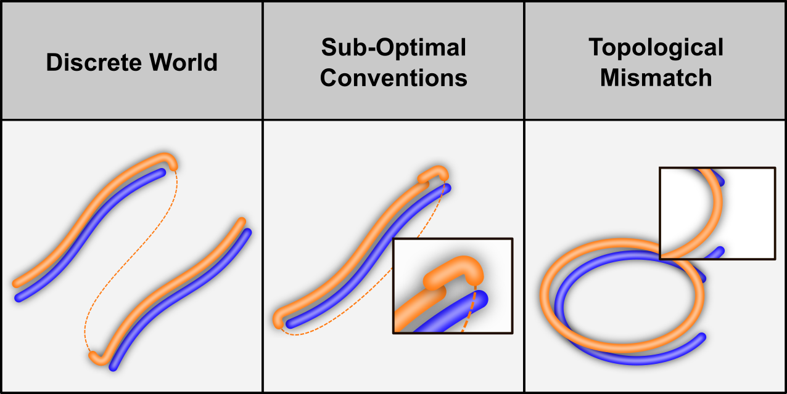
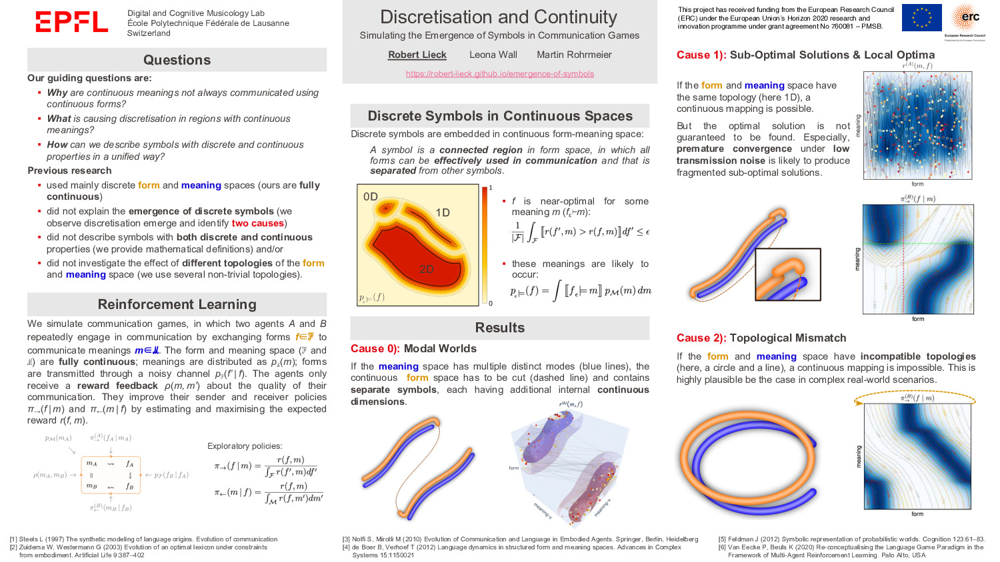

This page contains material from the **Emergence of Symbols** project, in particular, supplementary material for the journal paper

* Lieck R, Rohrmeier M (2021) [**Discretisation and continuity: The emergence of symbols in communication**](https://www.sciencedirect.com/science/article/pii/S0010027721002067). *Cognition* 215

and the short version presented at the CogSci 2021 conference

* Lieck R, Wall L, Rohrmeier M (2021) [**Discretisation and Continuity: Simulating the Emergence of Symbols in Communication Games**](CogSci2021/paper.pdf). In: *Proceedings of the 43th Annual Meeting of the Cognitive Science Society*. Vienna, Austria.

To cite this work, please refer to the extended journal version. You can use the following `BibTeX` entry:

```
@article{lieck2021,
  title = {Discretisation and Continuity: The Emergence of Symbols in Communication},
  author = {Lieck, Robert and Rohrmeier, Martin},
  year = {2021},
  journal = {Cognition},
  volume = {215},
  doi = {10.1016/j.cognition.2021.104787}
}
```

## CogSci 2021

#### Video

<video controls width="100%" src="CogSci2021/video.mp4"></video>

#### Poster

<a href="https://robert-lieck.github.io/emergence-of-symbols/CogSci2021/poster.pdf"></a>

## Supplementary Material (Journal Version)

[](https://doi.org/10.5281/zenodo.4717800)
[](https://creativecommons.org/licenses/by-nc/4.0/)

 - [*TwoLines* World Model (interactive 3D versions of Figure 13)](https://robert-lieck.github.io/emergence-of-symbols/two_lines/)

 - [Learning Progress (animation and detailed table of Figure 8)](https://robert-lieck.github.io/emergence-of-symbols/learning_progress)

