### Learning Progress (Figure 8)

<video controls loop width="100%" src="overview.mp4"></video>

| Iteration (Agent) | Expected Reward | Sender Policy | Receiver Policy | Permissibility Regions | Symbols |
| ---- | ---- | ---- | ---- | ---- | ---- |
| 0 (A) |  | 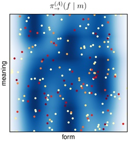 | 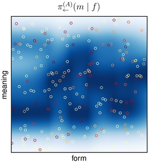 | 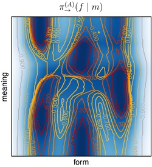 | 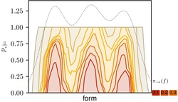 |
|          | [PDF](pdf/iteration-0000000-(002).pdf) | [PDF](pdf/iteration-0000000-(004).pdf) | [PDF](pdf/iteration-0000000-(005).pdf) | [PDF](pdf/iteration-0000000-(011).pdf) | [PDF](pdf/iteration-0000000-(012).pdf) |
| 0 (B) | 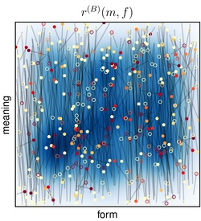 | 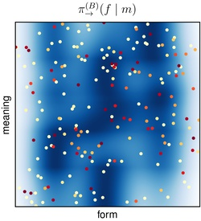 | 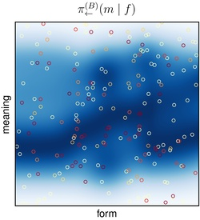 | 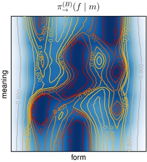 | 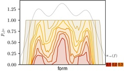 |
|          | [PDF](pdf/iteration-0000000-(007).pdf) | [PDF](pdf/iteration-0000000-(009).pdf) | [PDF](pdf/iteration-0000000-(010).pdf) | [PDF](pdf/iteration-0000000-(013).pdf) | [PDF](pdf/iteration-0000000-(014).pdf) |
| 1 (A) | 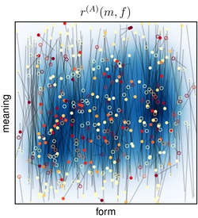 | 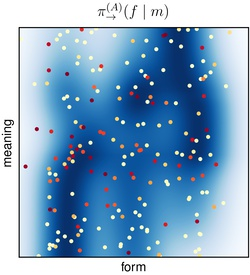 | 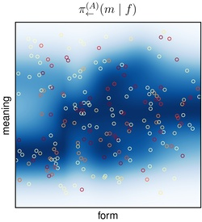 | 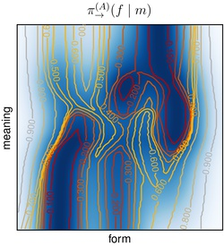 | 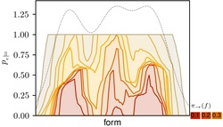 |
|          | [PDF](pdf/iteration-0000001-(002).pdf) | [PDF](pdf/iteration-0000001-(004).pdf) | [PDF](pdf/iteration-0000001-(005).pdf) | [PDF](pdf/iteration-0000001-(011).pdf) | [PDF](pdf/iteration-0000001-(012).pdf) |
| 1 (B) | 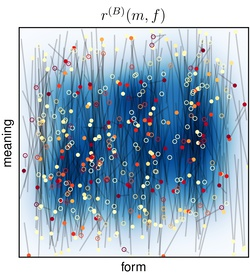 | 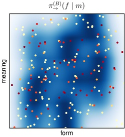 | 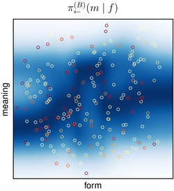 | 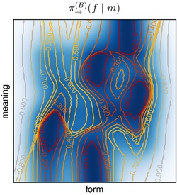 | 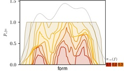 |
|          | [PDF](pdf/iteration-0000001-(007).pdf) | [PDF](pdf/iteration-0000001-(009).pdf) | [PDF](pdf/iteration-0000001-(010).pdf) | [PDF](pdf/iteration-0000001-(013).pdf) | [PDF](pdf/iteration-0000001-(014).pdf) |
| 2 (A) | 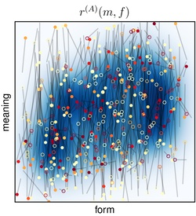 | 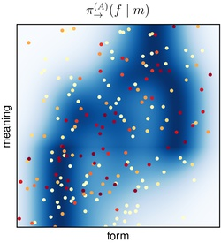 |  | 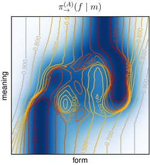 | 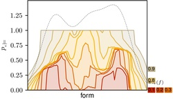 |
|          | [PDF](pdf/iteration-0000002-(002).pdf) | [PDF](pdf/iteration-0000002-(004).pdf) | [PDF](pdf/iteration-0000002-(005).pdf) | [PDF](pdf/iteration-0000002-(011).pdf) | [PDF](pdf/iteration-0000002-(012).pdf) |
| 2 (B) | 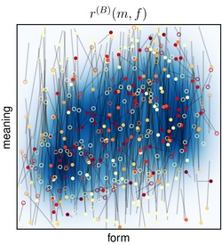 | 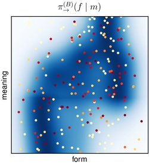 | 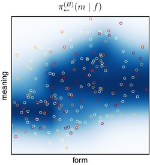 | 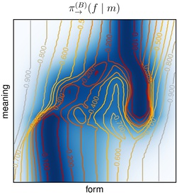 |  |
|          | [PDF](pdf/iteration-0000002-(007).pdf) | [PDF](pdf/iteration-0000002-(009).pdf) | [PDF](pdf/iteration-0000002-(010).pdf) | [PDF](pdf/iteration-0000002-(013).pdf) | [PDF](pdf/iteration-0000002-(014).pdf) |
| 3 (A) | 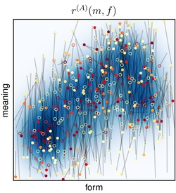 | 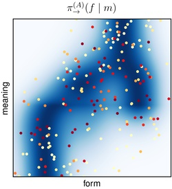 | 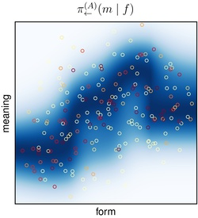 | 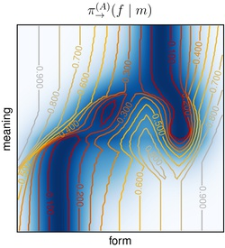 | 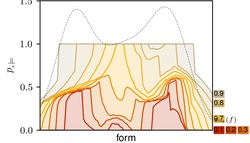 |
|          | [PDF](pdf/iteration-0000003-(002).pdf) | [PDF](pdf/iteration-0000003-(004).pdf) | [PDF](pdf/iteration-0000003-(005).pdf) | [PDF](pdf/iteration-0000003-(011).pdf) | [PDF](pdf/iteration-0000003-(012).pdf) |
| 3 (B) | 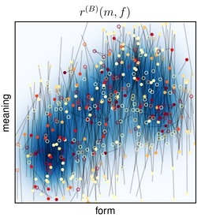 | 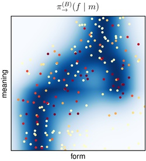 | 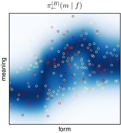 |  |  |
|          | [PDF](pdf/iteration-0000003-(007).pdf) | [PDF](pdf/iteration-0000003-(009).pdf) | [PDF](pdf/iteration-0000003-(010).pdf) | [PDF](pdf/iteration-0000003-(013).pdf) | [PDF](pdf/iteration-0000003-(014).pdf) |
| 4 (A) | 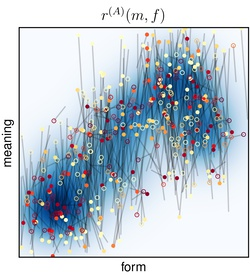 | 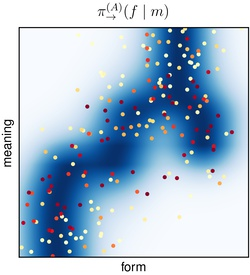 | 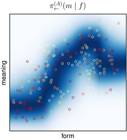 | 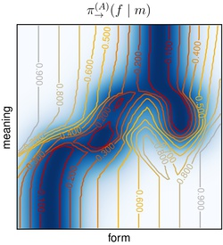 | 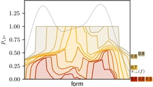 |
|          | [PDF](pdf/iteration-0000004-(002).pdf) | [PDF](pdf/iteration-0000004-(004).pdf) | [PDF](pdf/iteration-0000004-(005).pdf) | [PDF](pdf/iteration-0000004-(011).pdf) | [PDF](pdf/iteration-0000004-(012).pdf) |
| 4 (B) | 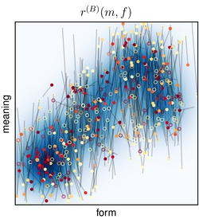 | 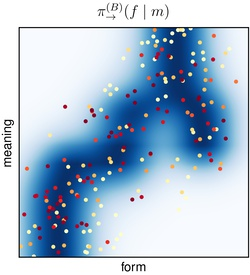 | 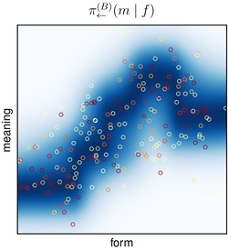 | 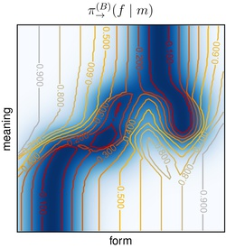 | 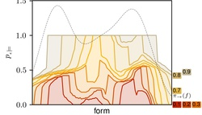 |
|          | [PDF](pdf/iteration-0000004-(007).pdf) | [PDF](pdf/iteration-0000004-(009).pdf) | [PDF](pdf/iteration-0000004-(010).pdf) | [PDF](pdf/iteration-0000004-(013).pdf) | [PDF](pdf/iteration-0000004-(014).pdf) |
| 5 (A) | 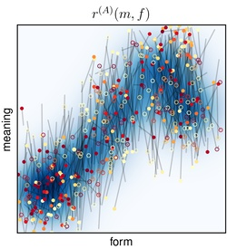 | 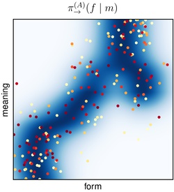 | 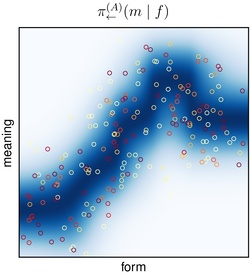 | 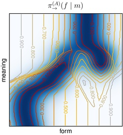 | 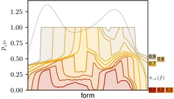 |
|          | [PDF](pdf/iteration-0000005-(002).pdf) | [PDF](pdf/iteration-0000005-(004).pdf) | [PDF](pdf/iteration-0000005-(005).pdf) | [PDF](pdf/iteration-0000005-(011).pdf) | [PDF](pdf/iteration-0000005-(012).pdf) |
| 5 (B) |  |  |  |  |  |
|          | [PDF](pdf/iteration-0000005-(007).pdf) | [PDF](pdf/iteration-0000005-(009).pdf) | [PDF](pdf/iteration-0000005-(010).pdf) | [PDF](pdf/iteration-0000005-(013).pdf) | [PDF](pdf/iteration-0000005-(014).pdf) |
| 6 (A) |  |  |  |  |  |
|          | [PDF](pdf/iteration-0000006-(002).pdf) | [PDF](pdf/iteration-0000006-(004).pdf) | [PDF](pdf/iteration-0000006-(005).pdf) | [PDF](pdf/iteration-0000006-(011).pdf) | [PDF](pdf/iteration-0000006-(012).pdf) |
| 6 (B) |  |  |  |  |  |
|          | [PDF](pdf/iteration-0000006-(007).pdf) | [PDF](pdf/iteration-0000006-(009).pdf) | [PDF](pdf/iteration-0000006-(010).pdf) | [PDF](pdf/iteration-0000006-(013).pdf) | [PDF](pdf/iteration-0000006-(014).pdf) |
| 7 (A) |  |  |  |  |  |
|          | [PDF](pdf/iteration-0000007-(002).pdf) | [PDF](pdf/iteration-0000007-(004).pdf) | [PDF](pdf/iteration-0000007-(005).pdf) | [PDF](pdf/iteration-0000007-(011).pdf) | [PDF](pdf/iteration-0000007-(012).pdf) |
| 7 (B) |  |  |  |  |  |
|          | [PDF](pdf/iteration-0000007-(007).pdf) | [PDF](pdf/iteration-0000007-(009).pdf) | [PDF](pdf/iteration-0000007-(010).pdf) | [PDF](pdf/iteration-0000007-(013).pdf) | [PDF](pdf/iteration-0000007-(014).pdf) |
| 8 (A) |  |  |  |  |  |
|          | [PDF](pdf/iteration-0000008-(002).pdf) | [PDF](pdf/iteration-0000008-(004).pdf) | [PDF](pdf/iteration-0000008-(005).pdf) | [PDF](pdf/iteration-0000008-(011).pdf) | [PDF](pdf/iteration-0000008-(012).pdf) |
| 8 (B) |  |  |  |  |  |
|          | [PDF](pdf/iteration-0000008-(007).pdf) | [PDF](pdf/iteration-0000008-(009).pdf) | [PDF](pdf/iteration-0000008-(010).pdf) | [PDF](pdf/iteration-0000008-(013).pdf) | [PDF](pdf/iteration-0000008-(014).pdf) |
| 9 (A) |  |  |  |  |  |
|          | [PDF](pdf/iteration-0000009-(002).pdf) | [PDF](pdf/iteration-0000009-(004).pdf) | [PDF](pdf/iteration-0000009-(005).pdf) | [PDF](pdf/iteration-0000009-(011).pdf) | [PDF](pdf/iteration-0000009-(012).pdf) |
| 9 (B) |  |  |  |  |  |
|          | [PDF](pdf/iteration-0000009-(007).pdf) | [PDF](pdf/iteration-0000009-(009).pdf) | [PDF](pdf/iteration-0000009-(010).pdf) | [PDF](pdf/iteration-0000009-(013).pdf) | [PDF](pdf/iteration-0000009-(014).pdf) |
| 10 (A) |  |  |  |  |  |
|          | [PDF](pdf/iteration-0000010-(002).pdf) | [PDF](pdf/iteration-0000010-(004).pdf) | [PDF](pdf/iteration-0000010-(005).pdf) | [PDF](pdf/iteration-0000010-(011).pdf) | [PDF](pdf/iteration-0000010-(012).pdf) |
| 10 (B) |  |  |  |  |  |
|          | [PDF](pdf/iteration-0000010-(007).pdf) | [PDF](pdf/iteration-0000010-(009).pdf) | [PDF](pdf/iteration-0000010-(010).pdf) | [PDF](pdf/iteration-0000010-(013).pdf) | [PDF](pdf/iteration-0000010-(014).pdf) |
| 11 (A) |  |  |  |  |  |
|          | [PDF](pdf/iteration-0000011-(002).pdf) | [PDF](pdf/iteration-0000011-(004).pdf) | [PDF](pdf/iteration-0000011-(005).pdf) | [PDF](pdf/iteration-0000011-(011).pdf) | [PDF](pdf/iteration-0000011-(012).pdf) |
| 11 (B) |  |  |  |  |  |
|          | [PDF](pdf/iteration-0000011-(007).pdf) | [PDF](pdf/iteration-0000011-(009).pdf) | [PDF](pdf/iteration-0000011-(010).pdf) | [PDF](pdf/iteration-0000011-(013).pdf) | [PDF](pdf/iteration-0000011-(014).pdf) |
| 12 (A) |  |  |  |  |  |
|          | [PDF](pdf/iteration-0000012-(002).pdf) | [PDF](pdf/iteration-0000012-(004).pdf) | [PDF](pdf/iteration-0000012-(005).pdf) | [PDF](pdf/iteration-0000012-(011).pdf) | [PDF](pdf/iteration-0000012-(012).pdf) |
| 12 (B) |  |  |  |  |  |
|          | [PDF](pdf/iteration-0000012-(007).pdf) | [PDF](pdf/iteration-0000012-(009).pdf) | [PDF](pdf/iteration-0000012-(010).pdf) | [PDF](pdf/iteration-0000012-(013).pdf) | [PDF](pdf/iteration-0000012-(014).pdf) |
| 13 (A) |  |  |  |  |  |
|          | [PDF](pdf/iteration-0000013-(002).pdf) | [PDF](pdf/iteration-0000013-(004).pdf) | [PDF](pdf/iteration-0000013-(005).pdf) | [PDF](pdf/iteration-0000013-(011).pdf) | [PDF](pdf/iteration-0000013-(012).pdf) |
| 13 (B) |  |  |  |  |  |
|          | [PDF](pdf/iteration-0000013-(007).pdf) | [PDF](pdf/iteration-0000013-(009).pdf) | [PDF](pdf/iteration-0000013-(010).pdf) | [PDF](pdf/iteration-0000013-(013).pdf) | [PDF](pdf/iteration-0000013-(014).pdf) |
| 14 (A) |  |  |  |  |  |
|          | [PDF](pdf/iteration-0000014-(002).pdf) | [PDF](pdf/iteration-0000014-(004).pdf) | [PDF](pdf/iteration-0000014-(005).pdf) | [PDF](pdf/iteration-0000014-(011).pdf) | [PDF](pdf/iteration-0000014-(012).pdf) |
| 14 (B) |  |  |  |  |  |
|          | [PDF](pdf/iteration-0000014-(007).pdf) | [PDF](pdf/iteration-0000014-(009).pdf) | [PDF](pdf/iteration-0000014-(010).pdf) | [PDF](pdf/iteration-0000014-(013).pdf) | [PDF](pdf/iteration-0000014-(014).pdf) |
| 15 (A) |  |  |  |  |  |
|          | [PDF](pdf/iteration-0000015-(002).pdf) | [PDF](pdf/iteration-0000015-(004).pdf) | [PDF](pdf/iteration-0000015-(005).pdf) | [PDF](pdf/iteration-0000015-(011).pdf) | [PDF](pdf/iteration-0000015-(012).pdf) |
| 15 (B) |  |  |  |  |  |
|          | [PDF](pdf/iteration-0000015-(007).pdf) | [PDF](pdf/iteration-0000015-(009).pdf) | [PDF](pdf/iteration-0000015-(010).pdf) | [PDF](pdf/iteration-0000015-(013).pdf) | [PDF](pdf/iteration-0000015-(014).pdf) |
| 16 (A) |  |  |  |  |  |
|          | [PDF](pdf/iteration-0000016-(002).pdf) | [PDF](pdf/iteration-0000016-(004).pdf) | [PDF](pdf/iteration-0000016-(005).pdf) | [PDF](pdf/iteration-0000016-(011).pdf) | [PDF](pdf/iteration-0000016-(012).pdf) |
| 16 (B) |  |  |  |  |  |
|          | [PDF](pdf/iteration-0000016-(007).pdf) | [PDF](pdf/iteration-0000016-(009).pdf) | [PDF](pdf/iteration-0000016-(010).pdf) | [PDF](pdf/iteration-0000016-(013).pdf) | [PDF](pdf/iteration-0000016-(014).pdf) |
| 17 (A) |  |  |  |  |  |
|          | [PDF](pdf/iteration-0000017-(002).pdf) | [PDF](pdf/iteration-0000017-(004).pdf) | [PDF](pdf/iteration-0000017-(005).pdf) | [PDF](pdf/iteration-0000017-(011).pdf) | [PDF](pdf/iteration-0000017-(012).pdf) |
| 17 (B) |  |  |  |  |  |
|          | [PDF](pdf/iteration-0000017-(007).pdf) | [PDF](pdf/iteration-0000017-(009).pdf) | [PDF](pdf/iteration-0000017-(010).pdf) | [PDF](pdf/iteration-0000017-(013).pdf) | [PDF](pdf/iteration-0000017-(014).pdf) |
| 18 (A) |  |  |  |  |  |
|          | [PDF](pdf/iteration-0000018-(002).pdf) | [PDF](pdf/iteration-0000018-(004).pdf) | [PDF](pdf/iteration-0000018-(005).pdf) | [PDF](pdf/iteration-0000018-(011).pdf) | [PDF](pdf/iteration-0000018-(012).pdf) |
| 18 (B) |  |  |  |  |  |
|          | [PDF](pdf/iteration-0000018-(007).pdf) | [PDF](pdf/iteration-0000018-(009).pdf) | [PDF](pdf/iteration-0000018-(010).pdf) | [PDF](pdf/iteration-0000018-(013).pdf) | [PDF](pdf/iteration-0000018-(014).pdf) |
| 19 (A) |  |  |  |  |  |
|          | [PDF](pdf/iteration-0000019-(002).pdf) | [PDF](pdf/iteration-0000019-(004).pdf) | [PDF](pdf/iteration-0000019-(005).pdf) | [PDF](pdf/iteration-0000019-(011).pdf) | [PDF](pdf/iteration-0000019-(012).pdf) |
| 19 (B) |  |  |  |  |  |
|          | [PDF](pdf/iteration-0000019-(007).pdf) | [PDF](pdf/iteration-0000019-(009).pdf) | [PDF](pdf/iteration-0000019-(010).pdf) | [PDF](pdf/iteration-0000019-(013).pdf) | [PDF](pdf/iteration-0000019-(014).pdf) |
| 20 (A) |  |  |  |  |  |
|          | [PDF](pdf/iteration-0000020-(002).pdf) | [PDF](pdf/iteration-0000020-(004).pdf) | [PDF](pdf/iteration-0000020-(005).pdf) | [PDF](pdf/iteration-0000020-(011).pdf) | [PDF](pdf/iteration-0000020-(012).pdf) |
| 20 (B) |  |  |  |  |  |
|          | [PDF](pdf/iteration-0000020-(007).pdf) | [PDF](pdf/iteration-0000020-(009).pdf) | [PDF](pdf/iteration-0000020-(010).pdf) | [PDF](pdf/iteration-0000020-(013).pdf) | [PDF](pdf/iteration-0000020-(014).pdf) |
| 21 (A) |  |  |  |  |  |
|          | [PDF](pdf/iteration-0000021-(002).pdf) | [PDF](pdf/iteration-0000021-(004).pdf) | [PDF](pdf/iteration-0000021-(005).pdf) | [PDF](pdf/iteration-0000021-(011).pdf) | [PDF](pdf/iteration-0000021-(012).pdf) |
| 21 (B) |  |  |  |  |  |
|          | [PDF](pdf/iteration-0000021-(007).pdf) | [PDF](pdf/iteration-0000021-(009).pdf) | [PDF](pdf/iteration-0000021-(010).pdf) | [PDF](pdf/iteration-0000021-(013).pdf) | [PDF](pdf/iteration-0000021-(014).pdf) |
| 22 (A) |  |  |  |  |  |
|          | [PDF](pdf/iteration-0000022-(002).pdf) | [PDF](pdf/iteration-0000022-(004).pdf) | [PDF](pdf/iteration-0000022-(005).pdf) | [PDF](pdf/iteration-0000022-(011).pdf) | [PDF](pdf/iteration-0000022-(012).pdf) |
| 22 (B) |  |  |  |  |  |
|          | [PDF](pdf/iteration-0000022-(007).pdf) | [PDF](pdf/iteration-0000022-(009).pdf) | [PDF](pdf/iteration-0000022-(010).pdf) | [PDF](pdf/iteration-0000022-(013).pdf) | [PDF](pdf/iteration-0000022-(014).pdf) |
| 23 (A) |  |  |  |  |  |
|          | [PDF](pdf/iteration-0000023-(002).pdf) | [PDF](pdf/iteration-0000023-(004).pdf) | [PDF](pdf/iteration-0000023-(005).pdf) | [PDF](pdf/iteration-0000023-(011).pdf) | [PDF](pdf/iteration-0000023-(012).pdf) |
| 23 (B) |  |  |  |  |  |
|          | [PDF](pdf/iteration-0000023-(007).pdf) | [PDF](pdf/iteration-0000023-(009).pdf) | [PDF](pdf/iteration-0000023-(010).pdf) | [PDF](pdf/iteration-0000023-(013).pdf) | [PDF](pdf/iteration-0000023-(014).pdf) |
| 24 (A) |  |  |  |  |  |
|          | [PDF](pdf/iteration-0000024-(002).pdf) | [PDF](pdf/iteration-0000024-(004).pdf) | [PDF](pdf/iteration-0000024-(005).pdf) | [PDF](pdf/iteration-0000024-(011).pdf) | [PDF](pdf/iteration-0000024-(012).pdf) |
| 24 (B) |  |  |  |  |  |
|          | [PDF](pdf/iteration-0000024-(007).pdf) | [PDF](pdf/iteration-0000024-(009).pdf) | [PDF](pdf/iteration-0000024-(010).pdf) | [PDF](pdf/iteration-0000024-(013).pdf) | [PDF](pdf/iteration-0000024-(014).pdf) |
| 25 (A) |  |  |  |  |  |
|          | [PDF](pdf/iteration-0000025-(002).pdf) | [PDF](pdf/iteration-0000025-(004).pdf) | [PDF](pdf/iteration-0000025-(005).pdf) | [PDF](pdf/iteration-0000025-(011).pdf) | [PDF](pdf/iteration-0000025-(012).pdf) |
| 25 (B) |  |  |  |  |  |
|          | [PDF](pdf/iteration-0000025-(007).pdf) | [PDF](pdf/iteration-0000025-(009).pdf) | [PDF](pdf/iteration-0000025-(010).pdf) | [PDF](pdf/iteration-0000025-(013).pdf) | [PDF](pdf/iteration-0000025-(014).pdf) |
| 26 (A) |  |  |  |  |  |
|          | [PDF](pdf/iteration-0000026-(002).pdf) | [PDF](pdf/iteration-0000026-(004).pdf) | [PDF](pdf/iteration-0000026-(005).pdf) | [PDF](pdf/iteration-0000026-(011).pdf) | [PDF](pdf/iteration-0000026-(012).pdf) |
| 26 (B) |  |  |  |  |  |
|          | [PDF](pdf/iteration-0000026-(007).pdf) | [PDF](pdf/iteration-0000026-(009).pdf) | [PDF](pdf/iteration-0000026-(010).pdf) | [PDF](pdf/iteration-0000026-(013).pdf) | [PDF](pdf/iteration-0000026-(014).pdf) |
| 27 (A) |  |  |  |  |  |
|          | [PDF](pdf/iteration-0000027-(002).pdf) | [PDF](pdf/iteration-0000027-(004).pdf) | [PDF](pdf/iteration-0000027-(005).pdf) | [PDF](pdf/iteration-0000027-(011).pdf) | [PDF](pdf/iteration-0000027-(012).pdf) |
| 27 (B) |  |  |  |  |  |
|          | [PDF](pdf/iteration-0000027-(007).pdf) | [PDF](pdf/iteration-0000027-(009).pdf) | [PDF](pdf/iteration-0000027-(010).pdf) | [PDF](pdf/iteration-0000027-(013).pdf) | [PDF](pdf/iteration-0000027-(014).pdf) |
| 28 (A) |  |  |  |  |  |
|          | [PDF](pdf/iteration-0000028-(002).pdf) | [PDF](pdf/iteration-0000028-(004).pdf) | [PDF](pdf/iteration-0000028-(005).pdf) | [PDF](pdf/iteration-0000028-(011).pdf) | [PDF](pdf/iteration-0000028-(012).pdf) |
| 28 (B) |  |  |  |  |  |
|          | [PDF](pdf/iteration-0000028-(007).pdf) | [PDF](pdf/iteration-0000028-(009).pdf) | [PDF](pdf/iteration-0000028-(010).pdf) | [PDF](pdf/iteration-0000028-(013).pdf) | [PDF](pdf/iteration-0000028-(014).pdf) |
| 29 (A) |  |  |  |  |  |
|          | [PDF](pdf/iteration-0000029-(002).pdf) | [PDF](pdf/iteration-0000029-(004).pdf) | [PDF](pdf/iteration-0000029-(005).pdf) | [PDF](pdf/iteration-0000029-(011).pdf) | [PDF](pdf/iteration-0000029-(012).pdf) |
| 29 (B) |  |  |  |  |  |
|          | [PDF](pdf/iteration-0000029-(007).pdf) | [PDF](pdf/iteration-0000029-(009).pdf) | [PDF](pdf/iteration-0000029-(010).pdf) | [PDF](pdf/iteration-0000029-(013).pdf) | [PDF](pdf/iteration-0000029-(014).pdf) |
| 30 (A) |  |  |  |  |  |
|          | [PDF](pdf/iteration-0000030-(002).pdf) | [PDF](pdf/iteration-0000030-(004).pdf) | [PDF](pdf/iteration-0000030-(005).pdf) | [PDF](pdf/iteration-0000030-(011).pdf) | [PDF](pdf/iteration-0000030-(012).pdf) |
| 30 (B) |  |  |  |  |  |
|          | [PDF](pdf/iteration-0000030-(007).pdf) | [PDF](pdf/iteration-0000030-(009).pdf) | [PDF](pdf/iteration-0000030-(010).pdf) | [PDF](pdf/iteration-0000030-(013).pdf) | [PDF](pdf/iteration-0000030-(014).pdf) |
| 31 (A) |  |  |  |  |  |
|          | [PDF](pdf/iteration-0000031-(002).pdf) | [PDF](pdf/iteration-0000031-(004).pdf) | [PDF](pdf/iteration-0000031-(005).pdf) | [PDF](pdf/iteration-0000031-(011).pdf) | [PDF](pdf/iteration-0000031-(012).pdf) |
| 31 (B) |  |  |  |  |  |
|          | [PDF](pdf/iteration-0000031-(007).pdf) | [PDF](pdf/iteration-0000031-(009).pdf) | [PDF](pdf/iteration-0000031-(010).pdf) | [PDF](pdf/iteration-0000031-(013).pdf) | [PDF](pdf/iteration-0000031-(014).pdf) |
| 32 (A) |  |  |  |  |  |
|          | [PDF](pdf/iteration-0000032-(002).pdf) | [PDF](pdf/iteration-0000032-(004).pdf) | [PDF](pdf/iteration-0000032-(005).pdf) | [PDF](pdf/iteration-0000032-(011).pdf) | [PDF](pdf/iteration-0000032-(012).pdf) |
| 32 (B) |  |  |  |  |  |
|          | [PDF](pdf/iteration-0000032-(007).pdf) | [PDF](pdf/iteration-0000032-(009).pdf) | [PDF](pdf/iteration-0000032-(010).pdf) | [PDF](pdf/iteration-0000032-(013).pdf) | [PDF](pdf/iteration-0000032-(014).pdf) |
| 33 (A) |  |  |  |  |  |
|          | [PDF](pdf/iteration-0000033-(002).pdf) | [PDF](pdf/iteration-0000033-(004).pdf) | [PDF](pdf/iteration-0000033-(005).pdf) | [PDF](pdf/iteration-0000033-(011).pdf) | [PDF](pdf/iteration-0000033-(012).pdf) |
| 33 (B) |  |  |  |  |  |
|          | [PDF](pdf/iteration-0000033-(007).pdf) | [PDF](pdf/iteration-0000033-(009).pdf) | [PDF](pdf/iteration-0000033-(010).pdf) | [PDF](pdf/iteration-0000033-(013).pdf) | [PDF](pdf/iteration-0000033-(014).pdf) |
| 34 (A) |  |  |  |  |  |
|          | [PDF](pdf/iteration-0000034-(002).pdf) | [PDF](pdf/iteration-0000034-(004).pdf) | [PDF](pdf/iteration-0000034-(005).pdf) | [PDF](pdf/iteration-0000034-(011).pdf) | [PDF](pdf/iteration-0000034-(012).pdf) |
| 34 (B) |  |  |  |  |  |
|          | [PDF](pdf/iteration-0000034-(007).pdf) | [PDF](pdf/iteration-0000034-(009).pdf) | [PDF](pdf/iteration-0000034-(010).pdf) | [PDF](pdf/iteration-0000034-(013).pdf) | [PDF](pdf/iteration-0000034-(014).pdf) |
| 35 (A) |  |  |  |  |  |
|          | [PDF](pdf/iteration-0000035-(002).pdf) | [PDF](pdf/iteration-0000035-(004).pdf) | [PDF](pdf/iteration-0000035-(005).pdf) | [PDF](pdf/iteration-0000035-(011).pdf) | [PDF](pdf/iteration-0000035-(012).pdf) |
| 35 (B) |  |  |  |  |  |
|          | [PDF](pdf/iteration-0000035-(007).pdf) | [PDF](pdf/iteration-0000035-(009).pdf) | [PDF](pdf/iteration-0000035-(010).pdf) | [PDF](pdf/iteration-0000035-(013).pdf) | [PDF](pdf/iteration-0000035-(014).pdf) |
| 36 (A) |  |  |  |  |  |
|          | [PDF](pdf/iteration-0000036-(002).pdf) | [PDF](pdf/iteration-0000036-(004).pdf) | [PDF](pdf/iteration-0000036-(005).pdf) | [PDF](pdf/iteration-0000036-(011).pdf) | [PDF](pdf/iteration-0000036-(012).pdf) |
| 36 (B) |  |  |  |  |  |
|          | [PDF](pdf/iteration-0000036-(007).pdf) | [PDF](pdf/iteration-0000036-(009).pdf) | [PDF](pdf/iteration-0000036-(010).pdf) | [PDF](pdf/iteration-0000036-(013).pdf) | [PDF](pdf/iteration-0000036-(014).pdf) |
| 37 (A) |  |  |  |  |  |
|          | [PDF](pdf/iteration-0000037-(002).pdf) | [PDF](pdf/iteration-0000037-(004).pdf) | [PDF](pdf/iteration-0000037-(005).pdf) | [PDF](pdf/iteration-0000037-(011).pdf) | [PDF](pdf/iteration-0000037-(012).pdf) |
| 37 (B) |  |  |  |  |  |
|          | [PDF](pdf/iteration-0000037-(007).pdf) | [PDF](pdf/iteration-0000037-(009).pdf) | [PDF](pdf/iteration-0000037-(010).pdf) | [PDF](pdf/iteration-0000037-(013).pdf) | [PDF](pdf/iteration-0000037-(014).pdf) |
| 38 (A) |  |  |  |  |  |
|          | [PDF](pdf/iteration-0000038-(002).pdf) | [PDF](pdf/iteration-0000038-(004).pdf) | [PDF](pdf/iteration-0000038-(005).pdf) | [PDF](pdf/iteration-0000038-(011).pdf) | [PDF](pdf/iteration-0000038-(012).pdf) |
| 38 (B) |  |  |  |  |  |
|          | [PDF](pdf/iteration-0000038-(007).pdf) | [PDF](pdf/iteration-0000038-(009).pdf) | [PDF](pdf/iteration-0000038-(010).pdf) | [PDF](pdf/iteration-0000038-(013).pdf) | [PDF](pdf/iteration-0000038-(014).pdf) |
| 39 (A) |  |  |  |  |  |
|          | [PDF](pdf/iteration-0000039-(002).pdf) | [PDF](pdf/iteration-0000039-(004).pdf) | [PDF](pdf/iteration-0000039-(005).pdf) | [PDF](pdf/iteration-0000039-(011).pdf) | [PDF](pdf/iteration-0000039-(012).pdf) |
| 39 (B) |  |  |  |  |  |
|          | [PDF](pdf/iteration-0000039-(007).pdf) | [PDF](pdf/iteration-0000039-(009).pdf) | [PDF](pdf/iteration-0000039-(010).pdf) | [PDF](pdf/iteration-0000039-(013).pdf) | [PDF](pdf/iteration-0000039-(014).pdf) |
| 40 (A) |  |  |  |  |  |
|          | [PDF](pdf/iteration-0000040-(002).pdf) | [PDF](pdf/iteration-0000040-(004).pdf) | [PDF](pdf/iteration-0000040-(005).pdf) | [PDF](pdf/iteration-0000040-(011).pdf) | [PDF](pdf/iteration-0000040-(012).pdf) |
| 40 (B) |  |  |  |  |  |
|          | [PDF](pdf/iteration-0000040-(007).pdf) | [PDF](pdf/iteration-0000040-(009).pdf) | [PDF](pdf/iteration-0000040-(010).pdf) | [PDF](pdf/iteration-0000040-(013).pdf) | [PDF](pdf/iteration-0000040-(014).pdf) |
| 41 (A) |  |  |  |  |  |
|          | [PDF](pdf/iteration-0000041-(002).pdf) | [PDF](pdf/iteration-0000041-(004).pdf) | [PDF](pdf/iteration-0000041-(005).pdf) | [PDF](pdf/iteration-0000041-(011).pdf) | [PDF](pdf/iteration-0000041-(012).pdf) |
| 41 (B) |  |  |  |  |  |
|          | [PDF](pdf/iteration-0000041-(007).pdf) | [PDF](pdf/iteration-0000041-(009).pdf) | [PDF](pdf/iteration-0000041-(010).pdf) | [PDF](pdf/iteration-0000041-(013).pdf) | [PDF](pdf/iteration-0000041-(014).pdf) |
| 42 (A) |  |  |  |  |  |
|          | [PDF](pdf/iteration-0000042-(002).pdf) | [PDF](pdf/iteration-0000042-(004).pdf) | [PDF](pdf/iteration-0000042-(005).pdf) | [PDF](pdf/iteration-0000042-(011).pdf) | [PDF](pdf/iteration-0000042-(012).pdf) |
| 42 (B) |  |  |  |  |  |
|          | [PDF](pdf/iteration-0000042-(007).pdf) | [PDF](pdf/iteration-0000042-(009).pdf) | [PDF](pdf/iteration-0000042-(010).pdf) | [PDF](pdf/iteration-0000042-(013).pdf) | [PDF](pdf/iteration-0000042-(014).pdf) |
| 43 (A) |  |  |  |  |  |
|          | [PDF](pdf/iteration-0000043-(002).pdf) | [PDF](pdf/iteration-0000043-(004).pdf) | [PDF](pdf/iteration-0000043-(005).pdf) | [PDF](pdf/iteration-0000043-(011).pdf) | [PDF](pdf/iteration-0000043-(012).pdf) |
| 43 (B) |  |  |  |  |  |
|          | [PDF](pdf/iteration-0000043-(007).pdf) | [PDF](pdf/iteration-0000043-(009).pdf) | [PDF](pdf/iteration-0000043-(010).pdf) | [PDF](pdf/iteration-0000043-(013).pdf) | [PDF](pdf/iteration-0000043-(014).pdf) |
| 44 (A) |  |  |  |  |  |
|          | [PDF](pdf/iteration-0000044-(002).pdf) | [PDF](pdf/iteration-0000044-(004).pdf) | [PDF](pdf/iteration-0000044-(005).pdf) | [PDF](pdf/iteration-0000044-(011).pdf) | [PDF](pdf/iteration-0000044-(012).pdf) |
| 44 (B) |  |  |  |  |  |
|          | [PDF](pdf/iteration-0000044-(007).pdf) | [PDF](pdf/iteration-0000044-(009).pdf) | [PDF](pdf/iteration-0000044-(010).pdf) | [PDF](pdf/iteration-0000044-(013).pdf) | [PDF](pdf/iteration-0000044-(014).pdf) |
| 45 (A) |  |  |  |  |  |
|          | [PDF](pdf/iteration-0000045-(002).pdf) | [PDF](pdf/iteration-0000045-(004).pdf) | [PDF](pdf/iteration-0000045-(005).pdf) | [PDF](pdf/iteration-0000045-(011).pdf) | [PDF](pdf/iteration-0000045-(012).pdf) |
| 45 (B) |  |  |  |  |  |
|          | [PDF](pdf/iteration-0000045-(007).pdf) | [PDF](pdf/iteration-0000045-(009).pdf) | [PDF](pdf/iteration-0000045-(010).pdf) | [PDF](pdf/iteration-0000045-(013).pdf) | [PDF](pdf/iteration-0000045-(014).pdf) |
| 46 (A) |  |  |  |  |  |
|          | [PDF](pdf/iteration-0000046-(002).pdf) | [PDF](pdf/iteration-0000046-(004).pdf) | [PDF](pdf/iteration-0000046-(005).pdf) | [PDF](pdf/iteration-0000046-(011).pdf) | [PDF](pdf/iteration-0000046-(012).pdf) |
| 46 (B) |  |  |  |  |  |
|          | [PDF](pdf/iteration-0000046-(007).pdf) | [PDF](pdf/iteration-0000046-(009).pdf) | [PDF](pdf/iteration-0000046-(010).pdf) | [PDF](pdf/iteration-0000046-(013).pdf) | [PDF](pdf/iteration-0000046-(014).pdf) |
| 47 (A) |  |  |  |  |  |
|          | [PDF](pdf/iteration-0000047-(002).pdf) | [PDF](pdf/iteration-0000047-(004).pdf) | [PDF](pdf/iteration-0000047-(005).pdf) | [PDF](pdf/iteration-0000047-(011).pdf) | [PDF](pdf/iteration-0000047-(012).pdf) |
| 47 (B) |  |  |  |  |  |
|          | [PDF](pdf/iteration-0000047-(007).pdf) | [PDF](pdf/iteration-0000047-(009).pdf) | [PDF](pdf/iteration-0000047-(010).pdf) | [PDF](pdf/iteration-0000047-(013).pdf) | [PDF](pdf/iteration-0000047-(014).pdf) |
| 48 (A) |  |  |  |  |  |
|          | [PDF](pdf/iteration-0000048-(002).pdf) | [PDF](pdf/iteration-0000048-(004).pdf) | [PDF](pdf/iteration-0000048-(005).pdf) | [PDF](pdf/iteration-0000048-(011).pdf) | [PDF](pdf/iteration-0000048-(012).pdf) |
| 48 (B) |  |  |  |  |  |
|          | [PDF](pdf/iteration-0000048-(007).pdf) | [PDF](pdf/iteration-0000048-(009).pdf) | [PDF](pdf/iteration-0000048-(010).pdf) | [PDF](pdf/iteration-0000048-(013).pdf) | [PDF](pdf/iteration-0000048-(014).pdf) |
| 49 (A) |  |  |  |  |  |
|          | [PDF](pdf/iteration-0000049-(002).pdf) | [PDF](pdf/iteration-0000049-(004).pdf) | [PDF](pdf/iteration-0000049-(005).pdf) | [PDF](pdf/iteration-0000049-(011).pdf) | [PDF](pdf/iteration-0000049-(012).pdf) |
| 49 (B) |  |  |  |  |  |
|          | [PDF](pdf/iteration-0000049-(007).pdf) | [PDF](pdf/iteration-0000049-(009).pdf) | [PDF](pdf/iteration-0000049-(010).pdf) | [PDF](pdf/iteration-0000049-(013).pdf) | [PDF](pdf/iteration-0000049-(014).pdf) |