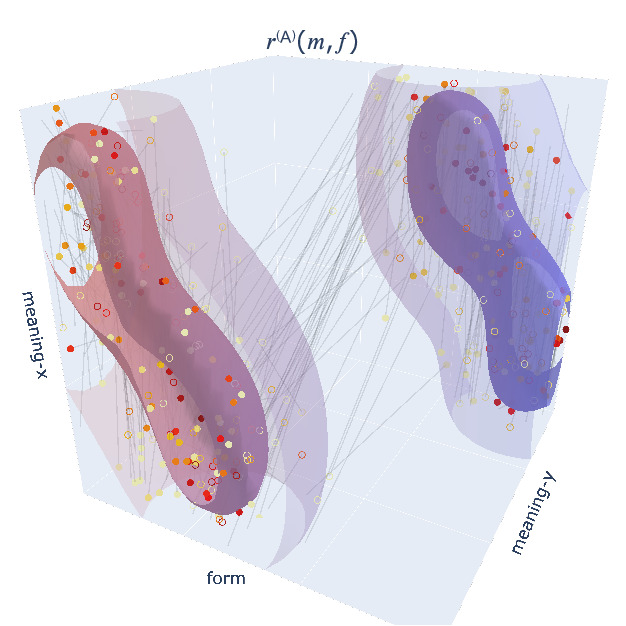
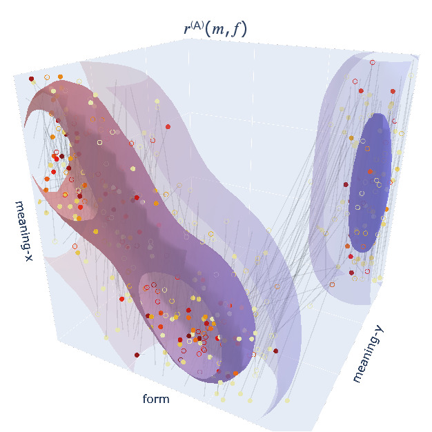
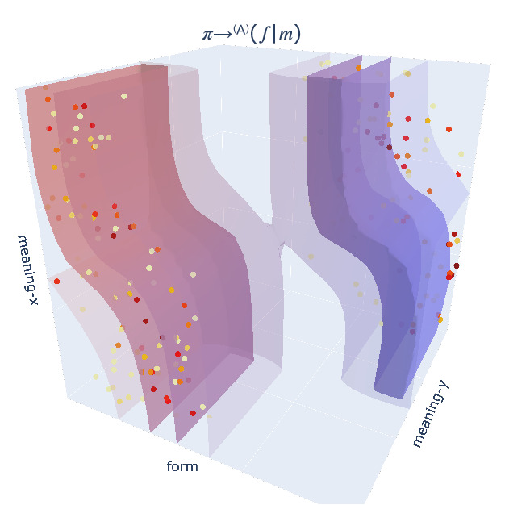
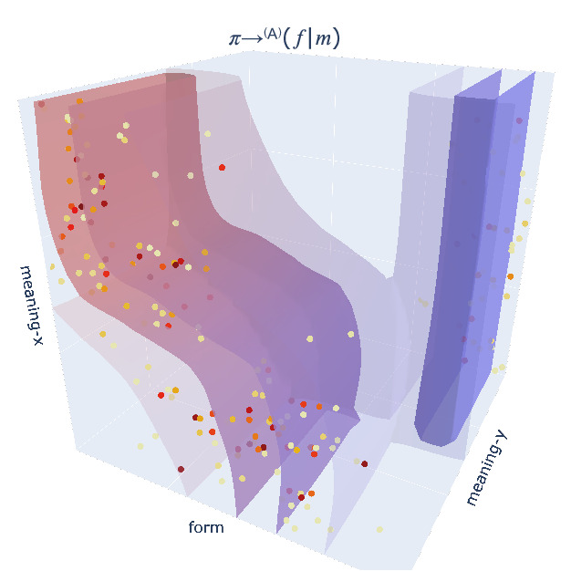
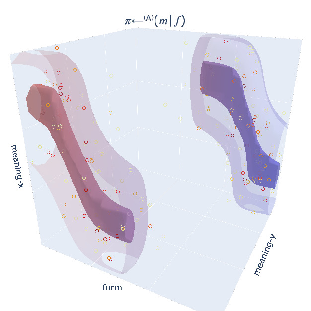
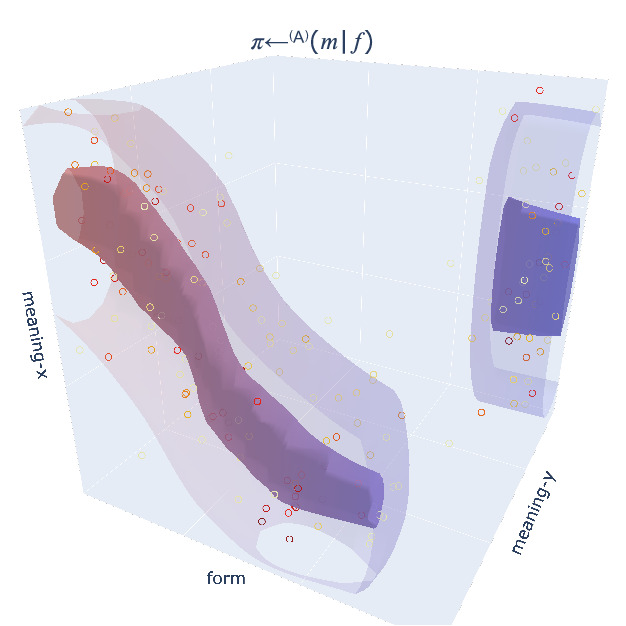

### *TwoLines* World Model (Figure 13)

Please click on the link below the respective sub-figure to view the PDF or interactive 3D version:

| (l1, l2) = (0.5, 0.5) | (l1, l2) = (0.3, 0.7) |
| ---- | ---- |
|  |  |
| [PDF version](https://robert-lieck.github.io/emergence-of-symbols/two_lines/50_50_reward.pdf) / [interactive 3D version](https://robert-lieck.github.io/emergence-of-symbols/two_lines/50_50_reward.html) | [PDF version](https://robert-lieck.github.io/emergence-of-symbols/two_lines/30_70_reward.pdf) / [interactive 3D version](https://robert-lieck.github.io/emergence-of-symbols/two_lines/30_70_reward.html) |
|  |  |
| [PDF version](https://robert-lieck.github.io/emergence-of-symbols/two_lines/50_50_sender_policy.pdf) / [interactive 3D version](https://robert-lieck.github.io/emergence-of-symbols/two_lines/50_50_sender_policy.html) | [PDF version](https://robert-lieck.github.io/emergence-of-symbols/two_lines/30_70_sender_policy.pdf) / [interactive 3D version](https://robert-lieck.github.io/emergence-of-symbols/two_lines/30_70_sender_policy.html) |
|  |  |
| [PDF version](https://robert-lieck.github.io/emergence-of-symbols/two_lines/50_50_receiver_policy.pdf) / [interactive 3D version](https://robert-lieck.github.io/emergence-of-symbols/two_lines/50_50_receiver_policy.html) | [PDF version](https://robert-lieck.github.io/emergence-of-symbols/two_lines/30_70_receiver_policy.pdf) / [interactive 3D version](https://robert-lieck.github.io/emergence-of-symbols/two_lines/30_70_receiver_policy.html) |

